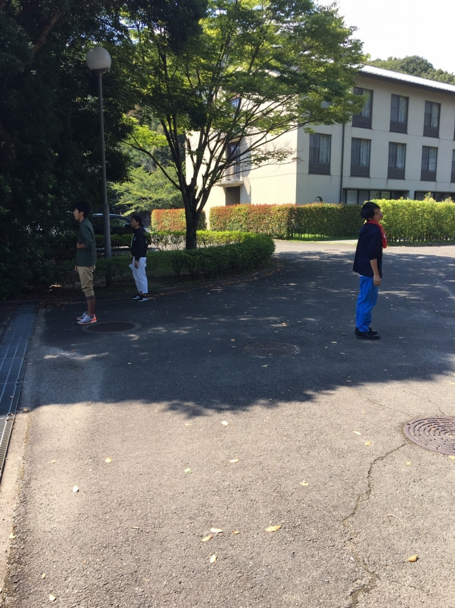

マッシュ：稽古最終日終わりましたね！この夏どうでした？

初代：そうですね…あっという間に終わりましたね！笑

マル：ん～、初代の夏の目標「痩せること」を達成できていないことが心残りでした…

初代：失礼な！2キロ痩せたわ！！

マル：あの～そろそろ眠いので失礼します

マッシュ：嘘やろ！？起きて

マル：ごめん、ふざけ過ぎた

マッシュ：ここで2回生ナタリーさんからのお便りを紹介します！

「演出の夜王さんはどうでした？」

初代：そうですね…最初の方はすごい怖い先輩だと思ってましたが、本格的に夏休みに入ってからはすごく面白くていい人だと思いました！笑

マル：ひじきの人と違ってとてもいい人でかっこよくて楽しい人だと思いました！

初代：おい！先輩やぞっ！！

マル：すみません

マッシュ：ジョージとメンマが見当たりませんが知りませんか？

マル：無茶振り凄ない？

初代：あの2人はキャンプで海に行った時日本海に流されてしまいました…

マッシュ：流された2人は放っておきましょう

それでは最後に本番への意気込みをどうぞ！

初代：この夏で培ったものを全て出し切って悔いのないようにしたいです！

マル：この夏で培ったものを全て出し切って悔いのないようにしたいです！

マル：お、初代気があうなぁ～

マッシュ：わたしも同じこと考えてた

初代：ほんまやな～w

マッシュ：3人の気持ちが一致したので寝ましょう！おやすみなさい！お疲れ様でした！

初代：お疲れ様でした！

マル：なんか微妙やな…

マッシュ：なんなんだお前は

初代：おい！やめろ！これ以上長引かせるな！！

## ゲネ

どうもご無沙汰しております。

昨日のブログの内容を決めていたとき寝ていたジョージです。

今日は、仕込みとうちのチームだけゲネがありました。仕込みが長引いて、ゲネしかできませんでしたが本番さながらの迫力がありました。

明後日の本番では全力で楽しめるようにしたいです。
