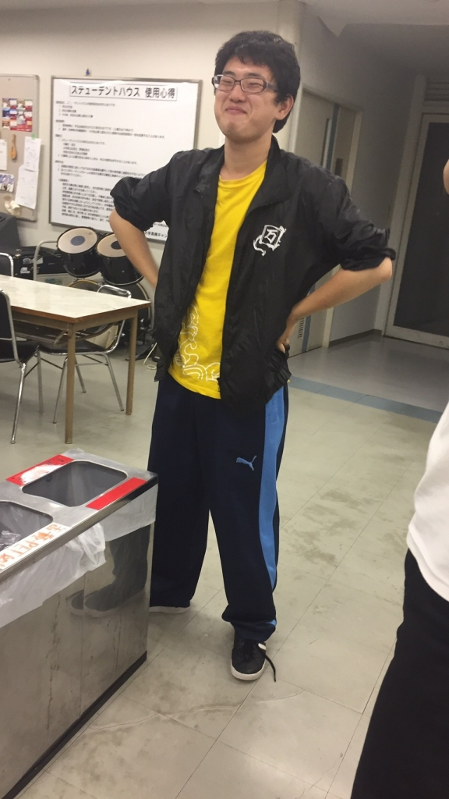

お疲れさまです‼

半年ぶりの役者で体力がなくバテ気味のかごめです。

今日は3チーム合同で基礎練習をしたあと段取りをつけました。

横で台詞回しの練習を一緒にしている1回生の成長がすごいです‼

今年の夏も体力をつけてみんなで楽しみたいです‼

## ツッコミ

2日遅れの投稿になります。カルピスです。写真が無いのは自分の携帯のカメラがインカメしか機能していないからです。なので皆さん自分の代わりにどんどん写真撮っちゃってください。なんだか次稽古場に行ったときボケツッコミエチュードをされそうな予感がします。それはそれとして、配役も決まりシーン回しが本格的に始まりました。長い間役者をやってないので久しぶりの稽古場でのシーン回しということでなんだか新鮮な気分でした。後稽古に参加して驚いたことが二つあります。一つは1回生が普通にボケツッコミエチュードをやっているという事です。1回生もTCを経て基礎練には大分慣れてきたから、という事でしょう。もう一つは風間がツッコミがめちゃくちゃ下手だった事です。

iPhoneから送信
