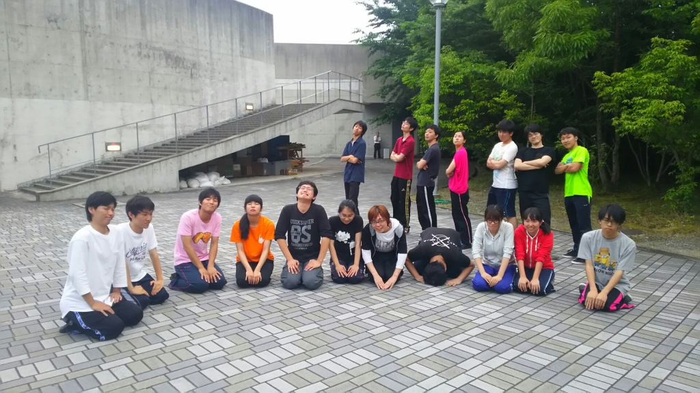

こんばんは！

2回生のもも議長です！

今日（昨日）はブレストをしました！

いやー、役とか台本を深く理解するのは

難しいですね・・・笑

でも、ブレストは台本理解を深めるため

ブレスト後は今までより面白く台本を見ることができますね

1回生みんな、役について深く考えていて

自分ももっと深くまで掘り下げねばなと思いました。

先輩アセアセ(゜ω゜;A)

このブレストを生かして、シーン回しに挑みたいですね

P.S アメンボダッシュはじめました。

1回生のDASHはかわいいです。

## その後、特訓しました。

こんにちは！

4回生のエーデルです。今回は音響チーフ務めさせていただきます！

最後の夏が始まりました。

時間がすぎるのって早いですね。

今日稽古場に顔を出したのですが、いやあ…フレッシュ！

まだまだ若いつもりですが、歳を取ったということでしょうか…？(笑)

どんな公演になるのか、1回生の今後の成長が期待です(\*´∀｀\*)

写真は熊背負いとの7ボウズ負け抜け戦で惜しくも全滅してしまったうちのチームです。

次は最後まで残れるように頑張って！
