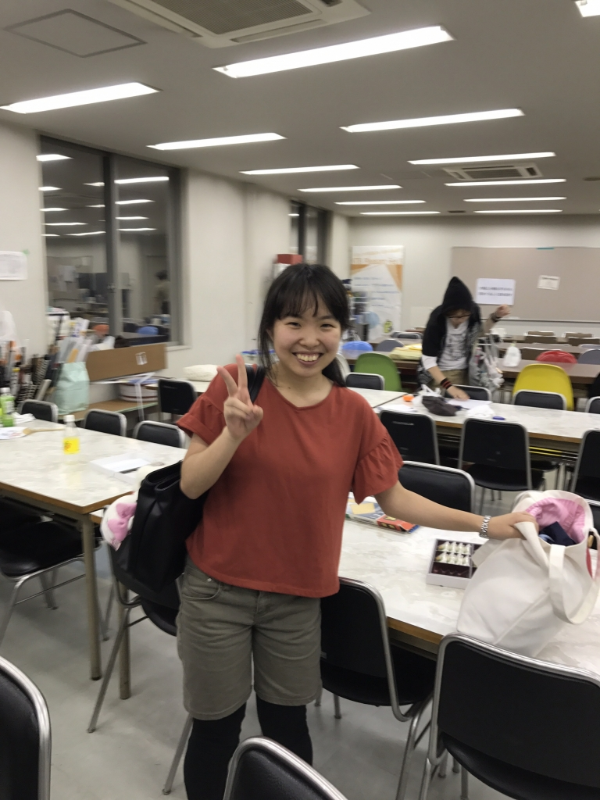

こんばんは！

1回生の自己紹介ブログも、最後になりました。

1回生のみゃーちゃんです！

みゃーって呼んでくれたらいいです！

高校のときは放送部に入っていました！そのこともあって、KTBにも入ってます。

昨日は夏公の練習で初めてのあら通しでしたね～。初めての通しだったので、とても緊張しました。

実際にやってみて、課題がたくさん残っているなぁって思いました。特に基礎練ですね(苦笑)。基礎がしっかりしてないと、声が出ないし、感情も表現しづらいです(泣)。

基礎練は”全力で”を目標に頑張ります！！

基礎練ができたら後は役作りですね。あと一ヶ月ちょっとで本番を迎えるので、ここからどれだけ成長できるか、楽しみですね～。

とにかく夏は全力DASHで頑張ります！！！

話は変わりますが、今日は七夕です～～。

毎日稽古で大変だと思いますが、七夕や球技大会でリフレッシュして、7/9からの稽古みんなで頑張りましょう&#8252;&#65038;
