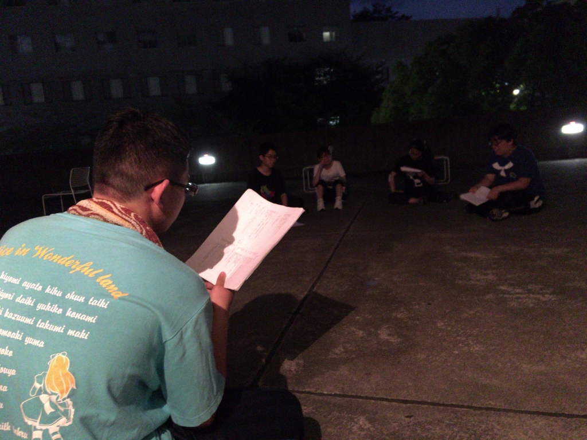

どうも！4回生の大和です！(((・ω・)))ついにこの時が来ました！

今日は3チーム全部学校での稽古ということで、たくさんの人で賑わった基礎練となりました！

7ボーズNo.1決定戦も行われたり、とっても充実した基礎練をしていました！

基礎練後はチームに分かれて稽古！我らがパズーチームも、限られた時間の中で一つひとつシーンを詰めていきます(｀・ω・´)！

写真は演出のパズーとダメ出しを受ける役者のみんな！

これからどう進化していくのか楽しみです！！！

私自身、今年の夏は本当に楽しみで、早く本番の日が来て欲しい気持ちと、まだこの夏が終わる日が来て欲しくない気持ちで早くも揺れています(笑)

相変わらず何事もしっかりしている同期、

しっかり下を引っ張ってくれる3回生、

去年から一転、先輩としてしっかり動く2回生、

そして、色んなことを吸収しようとしっかり頑張っている1回生。

今も含め、過去の自分と照らし合わせても、みんなしっかりしすぎて…何ひとつ勝てる気がしません(^ω^;)みんなすごい…！

そんなしっかりしたみんなで作る夏公演！！！そして我らがパズーチーム！！全員で全開で全力でDASHします！！お楽しみに！！！(＊´∀｀)

そして今日は20期生の出雲さん、じょうたろうさん、たきさんの3名が来てくださいました(＊´∀｀)

3つ全てのチームを見ていただき、ありがとうございました！ぜひ本番をお楽しみに(｀・ω・´)！です！

p.s.どうでもいいですが、ブログの挨拶は「どうも！○回生の大和です(((・ω・)))」で4年間統一感を持たせていたつもりが、ちょっと確認しただけでも「こんにちは！」だったり顔文字がなかったり、少しずつ違っていてちょっと自分にショックを受けてます(←
