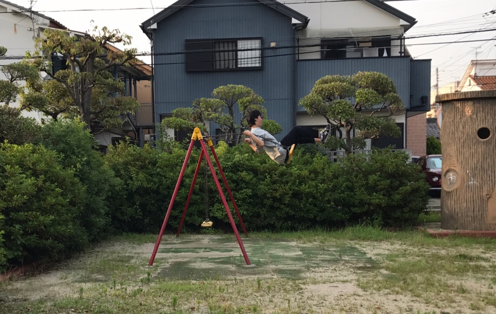

こんばんは

1回生のフォーミュラーです！

もうブログの2周目が回ってまいりました。

早いですね。

今日はふれあいのプレイルームで稽古をしました。プレイルーム、いいですね！ぬいぐるみが沢山あって。舞台はぬいぐるみを置いて作りました！笑

さて、本日も筋トレ、体幹、柔軟をやりました！本当に、ほんっとに、ほんッッッッッッッとに、しんどいですね！！高校では美術部員でした。座ってただ油絵を描いていた人間です。この前のブログにも書いた気もしますが、何度でも言います。この夏で人並みの体力をつけたいです！！つけます！！！！！

筋トレで腹筋40回だったんですが、フォーミュラーは10回程で限界を迎え、手を使ってしまいました…。ちなみにあまりにもできないので自分だけ腹筋35回に減らして頂きました。皆さんと同じだけやれるように、筋トレに励みます！！

セブンボーズ、タコ8もやりました！

セブンボーズでは、ミスを連発してしまいました。頭が回りません！！！！！！本当に毎回止めてしまいます。セブンボーズをやったときに、げげると風間がいなかったので余計に自分が止めてしまいました。ん～～～難しいなぁ………。

タコ8！タコ8はいいですね！とっても楽しいです！！！ずっとやっていたいくらいです。嘘です。でも楽しいのは本当です！！

今日の稽古はシーン回しでした！

やっと声が出てきて、台詞も少しずつ覚えてきました。しかし課題がまだまだ沢山、たっっっくさんあります。表情や動きも付けていけるようにしていしたいです。先輩方に色々教えて頂いています！先輩方からたくさん学んでいきたいです。

写真は稽古終わりに自主練のため、公園に行ったときのものです！ブランコに乗るげげる君です。遊んでません。ちゃんと自主練しました！！！！！！！

いよいよ17日は台本を外しての通しです！台詞やフリ、しっかり確認して臨みたいと思います！！

いっぱい書いた気がします！します！！
