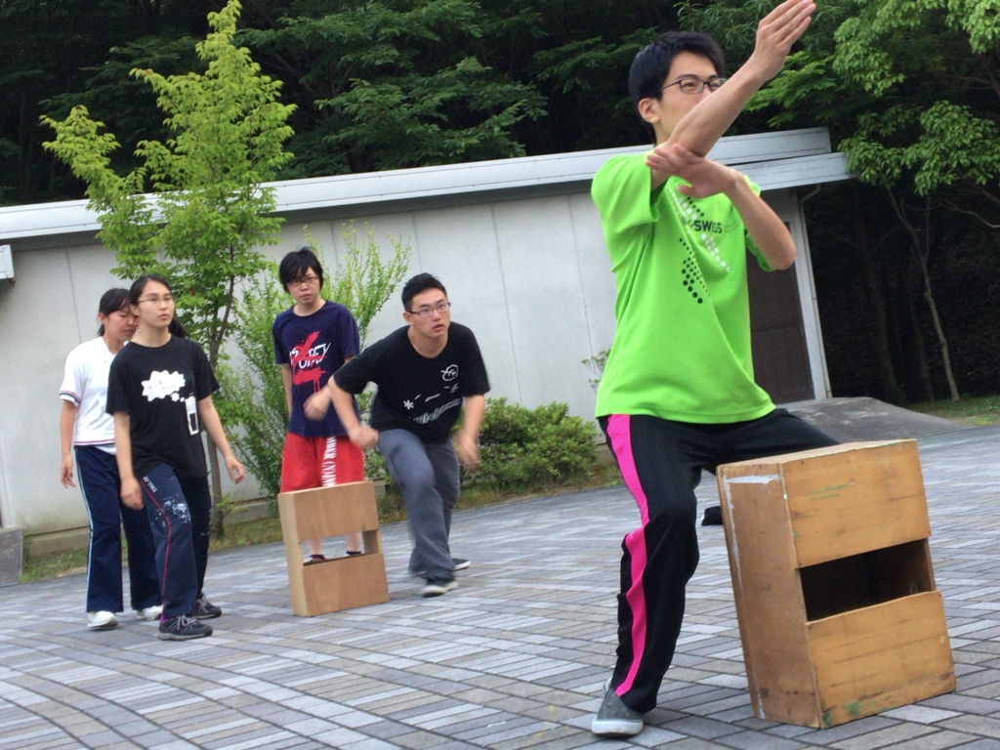
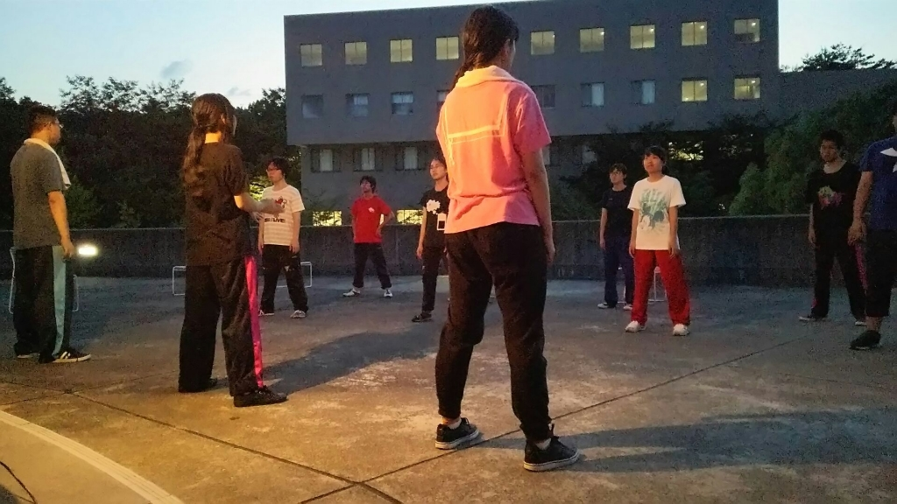

どうも！4回生の大和です！(((・ω・)))

早くも2度目のブログが回ってきました！そして早くもその2度目で睡魔に負けて日をまたいでしまいました:( ´ω\` ):不甲斐ない申し訳ない

昨日は学校稽古でしたが、珍しくも自チームだけの稽古でした…！

せっかくのこの機会にと、昨日の通しで課題となった部分を中心に発声練習を重ねた後、あめんぼダッシュやセブンボーズなどでキレを重視した基礎練をやっていました！

1回生も少しずつ"キレよく止まる"ことが意識できていて、確実に成長していってるのがわかり、これからも楽しみです(＊´∀｀)

基礎練の後はシーン回し！

稽古を見るのは1週間ぶりくらいでしたが、台本も外れ、両手自由に自分たちで段取りを付けて動き回っているのを見て、次来るのが本当に楽しみになりました！次も絶対近いうちにお邪魔したいと思います…！！

以上、大和でした！

絶対いいものができると思います！！本番お楽しみに(＊´∀｀)

## オープニング！

こんにちは。4回生のエーデルです！

２回目のブログが回ってきました。

今日の稽古はひたすらOPの練習でした。

新しく増えた振りを覚えるのにみんな四苦八苦してました(笑)

本番にはキレッキレに動けてるはずです…きっと！

もうすぐテスト週間が始まりますが、みんな同じくらいお勉強も頑張るはずでしょう！

それではこの辺で。
