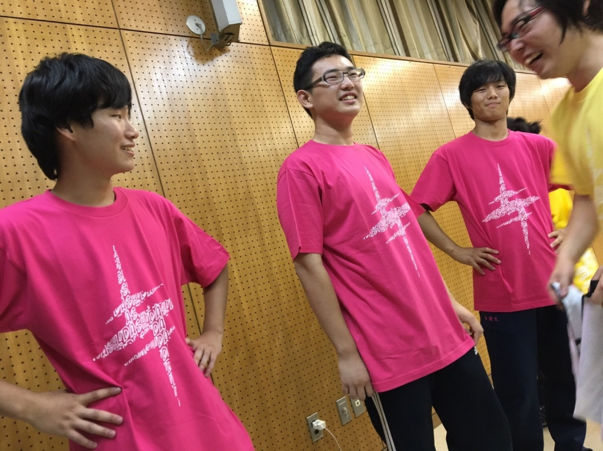
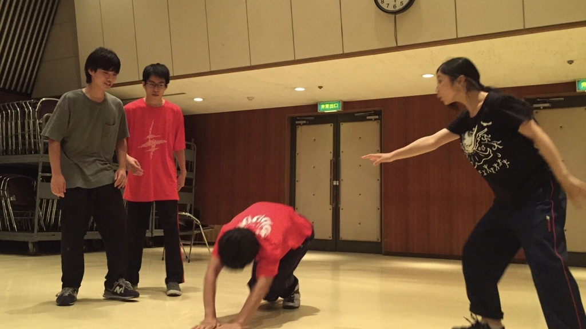

おはようございます！！パズーです！！！

ようやくテストも終わり、7月も終わり本

番まで残すところあと26日となりました。

夏公が始まり早1ヶ月半！もうそんなに経

ったのかという気持ちがいっぱいです。

気づけば入って3年が経っている、、、

もう3年かと思いつつ過去の2年間を振り返

り思うことがあります。

それは、1年前、2年前更にはもっと前の凄

い先輩達がいた場所に自分は立っている。

ということです。

後ろから見ててかっこいいと思ったあの背

中になれているのか、後の子達に何を教え

てあげられているのか。

「あの頃の自分と何か変わったのか。」

そう聞かれても、胸を張って変わったとは

答えられないと思います。

ですが、今の自分にできる精一杯を後輩達

や先輩達に見せたい！

最近、そう思いながらがむしゃらに頑張っ

てます。

夏公後半戦！！つまり、これからが夏休

み！！

一日稽古！キャンプ！高槻wave！萩谷

DASH！水浴び！高岳館宿泊！そして、本

番！！イベント盛り沢山！！！！

皮が剥け出し成長する1回生、それを促す

上回生、どんな子に育つか楽しみです。

『劇団全力坂DASH！』

その名に恥じぬよう全力で遊び、全力で稽

古していきます！！

写真はホットピンクを買った男3人トリオ

です。サツマイモみたいな色かと思ったん

ですがめっちゃどぎついピンクですね。超

ビックリです。

今は見慣れないと思いますが時期に見慣れ

ることを祈って着続けようと思います！！

iPhoneから送信

## れっつらごーー！

こんばんは！

4回生の如月です。

2度目のブログ、久びさのブログです。

毎日暑くて、高槻から富田の公民館に向かう自転車で稽古前から汗びっしょりになります。

テストも無事乗り越え？いよいよ夏の稽古も後半戦となり気が引き締まります！

今日はOBのアルゴさんを交え、ウインクキラーをしたりワンワードエチュードをしたり。。

如月は語彙が乏しくともボロが出ないワンワードエチュードが好きなのですが、やっぱりわかりやすい身振り手振りや大きな動作はむずかしいですね。もっと精進しないと……！

そんなかんじで稽古再開したのも束の間。

明日からは待ちに待ったキャンプです！！

うひょーー！！

海に山にBBQに温泉に…盛りだくさんなことでしょう！

それでは、明日に備えてはやく寝ます！

おやすみなさい。
