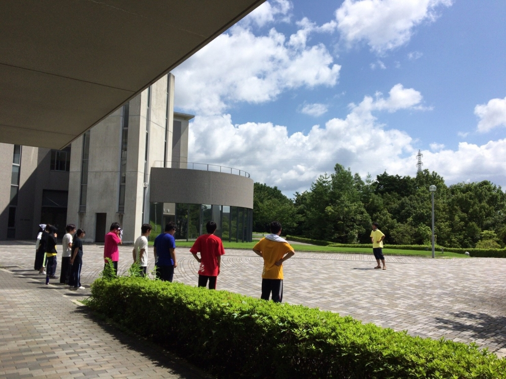

こんばんは、3度目のかなめです。

今日は学校稽古で暑いのを覚悟していたのですが、なんとコミュニティルームが開いていたのでクーラーの効いた部屋での練習となり、快適でした。

この時期になるとシーン回しが長回しになり、もう少しで夏公も終わりかと実感するようになりました。それはそれとして、また音響のQ数が増え、SE担当の大和さんがさらに多忙になりそうです。Q数があまりにも多いので、他の公演と比べる過程で卒公のQ数を見せてもらったのですが、比べ物にならなかったです。

残りの稽古日数も少なくなってきていますが、最後まで全力で頑張りましょう！！！
