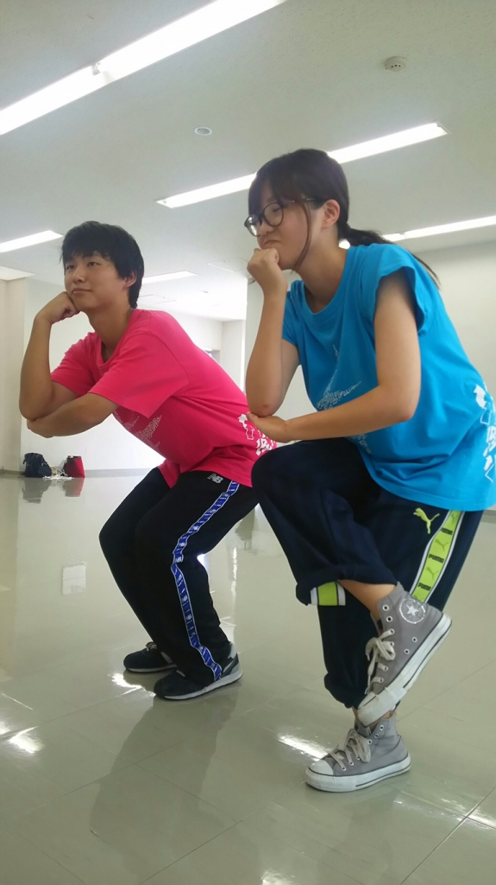
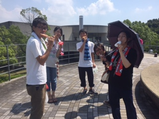

こんばんは！

最近おっさんやらフォーやらと呼ばれているF1すずかです。３回目にして最後のブログが回ってまいりました！

今日の稽古は長回し。

昨日のドレリハのダメだしをふまえて臨みました。練習できる時間も本当に残り僅かとなってしまいました。甘いところは詰めて、詰めて、少しでもよくなるように励みたいと思います。

写真はボケツッコミエチュードより、考える人です。最後の最後で罰ゲームのボケツッコミをやることになろうとは思ってもみませんでした。ちなみに私がツッコミだったのですが、難しいですね。実に難しかったです。普通のエチュードになってしまいました。精進します。

明日がなんと最後の通しです！！

今までやってきたことを出し切れるようにがんばります！

それでは！

## イメージするのは常に最強の自分

さっ さっ ぶん ぶん！

ココWi-Fiとんでんな。あ、どうもノンベジ・JK・花夏流です！

もうあっという間に夏が終わりますね、時間が経つのが早いなぁ…ドレリハを昨日行い明日は最終通し。今更危機感に追われ続けて死にたくなっている私です。慢心したから…

最近髪の毛をスッキリしました、床屋に行ってて思うんですけどあの固定されてる感じが歯医者と同じような恐怖を感じるんですけどわたしだけですかね？

歯医者に腹が立つのは痛くなったら左手あげてくださいね？っていいながらあげでも「もう少しだから我慢してくださいねー」この一言で全て却下されるところですよね…

この写真傘さしている人はアイスなんて食べたら苦痛に悶えると思うんですけど大丈夫なんですかね？

iPhoneから送信
