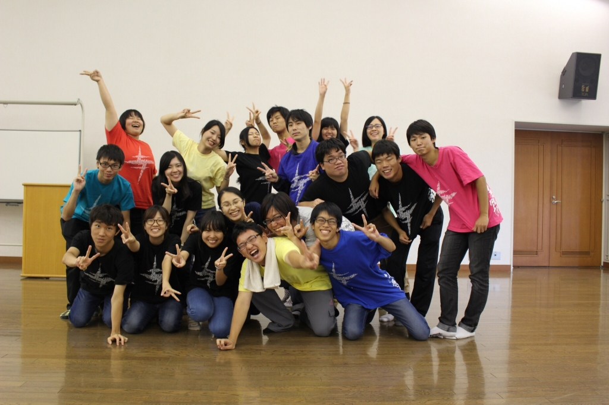

お疲れ様です。

夏演出だったパズーです。

遅くなりましたが、

劇団万絵巻2017年度第21回自主研究発表公演、

劇団 全力坂DASH！無事に完走することができま

した！

ご来場いただいたOB、OGの皆さま本当にありが

とうございました。

優柔不断で頼りない僕は演出として皆を引っ張る

リーダーにはなれなかったかもしれません。

ですが、

みんなと並び共に励まし合い、共に汗を流す。常

に笑顔で楽しくする。そんな、演出にはなれたと

僕は思っています。

正直に話すと、チーム発表の日まで本当に僕が演

出でいいのかそんな風に考えていました。

というのも、今まで見てきた演出をやる人という

のは常にこれをやろうという指針を持っている人

だと僕は思っていました。なので、今までやれる

だけのことをしてきた僕にとってその指針という

のは常になく、本当にみんなを１つのゴールに導

けるか自信がありませんでした。

でも、チーム発表の時皆の顔を見て投げ出すこと

だけは絶対辞めよう。今まで3年間で手に入れたも

の全て使ってこの公演を成功させよう。

その事だけを考えてきた3ヶ月でした。

その結果、本番は沢山の笑いに包まれ褒められる

そんな公演にすることができました。

頼りになる4回生、支えてくれる3回生、明るく元

気な2回生、どんどん成長してくれる1回生。

この公演が成功したのは皆の力があってこそだっ

たと思います。誰1人欠けていただけで形にならな

かったのではないかと思うほど、みんな助けてく

れました。

僕は感謝の気持ちでいっぱいです。

この夏本当に楽しかった！！

球技大会に七夕にキャンプで海にBBQにカレーに

温泉に稽古場でスイカ割りに水浴びに祭に行った

り本当に色んなことをしました。

毎日の稽古もいつも楽しいことがいっぱいでし

た。終わらなければいいのにと何回思ったことで

しょう。

全部全部いい思い出になりました。

楽しかった。楽しかった。

本当にありがとうございました！！
