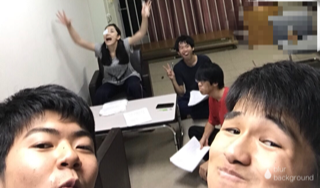

ブログをご覧の皆さん、こんばんは！

そして、ご無沙汰しておりました、気がつけばもう4回生になっており、将来どうなるんやろうと少し不安に思っている椎名真咲です！

いやー、ここ数公演役者をしていなかったこともあり、ブログに全く登場しておりませんでした笑

誰だ、こいつ？って思っている方もいらっしゃるかと思いますが、あたたかい目で見ていて下さい！

さて本日は、最近起こっております地震や未曾有の大雨の影響でしばらく稽古が出来ていなかったので、久しぶりにみんなに会えて、何より元気な姿が見られたので、ホットひと安心です。

なので、みんな無事です！そして、元気です！

そういうこともあり、久しぶりの稽古でみんないつもよりテンション高めだったように思います。

今日の基礎練は、喜怒哀楽エチュード！

タイミングに合わせて、喜怒哀楽を切り替えていく中々難しい内容のものです。

新入生は初めてのことで、戸惑っていましたが、食らいついて負けじと頑張っていました！

初々しいな～

そのあとはじゃんじゃん、シーン回し！

稽古休みだったからといって、休んでいる役者たちではありません！

しっかりと考えてきたものを演出に披露していました！

終始笑いが絶えない稽古場で、毎回毎回ワクワクしながら参加しています！

楽しいな！！！

そして何と今日は稽古終わりにみんなでご飯を食べに行きました！

そこでも稽古場と変わらない雰囲気のまま、ワイワイと食事の時間を楽しみました！

これから私たちはさらに成長すると思います。

特に新入生の成長は著しいものがあります。

私も負けじと頑張っていきたいと思います！

それでは、おやすみなさい、良い夢を…
