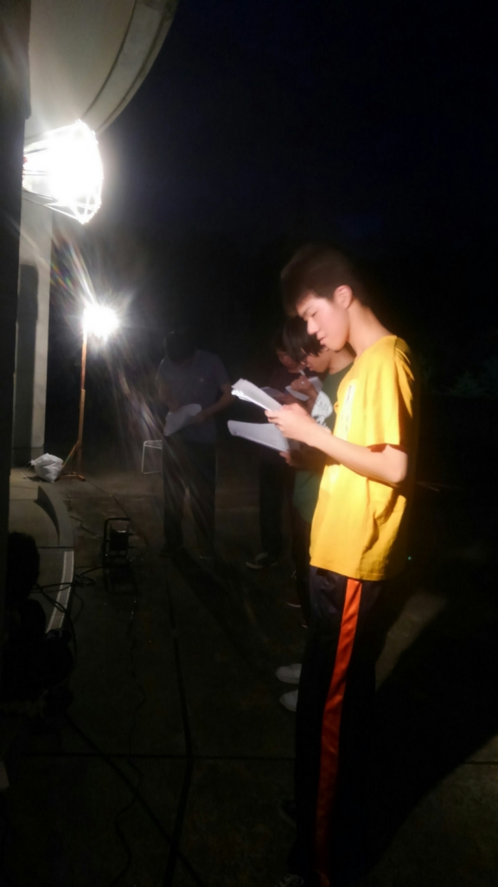

こんばんは！4回生のみりんです

今日も暑い中皆さんお疲れ様でした

ぼちぼち台詞を覚えてきたでしょうか？私はまだです

ところで皆さん。蒸し暑い中水分補給も大事ですが、虫対策もしておきましょう。稽古中だろうと、奴らは耳元を飛び交い、足に食らいついてきます。また高槻(山の上)キャンパスには蚊だけでなく、噛まれると厄介な虫がたくさんいます。スプレーなどの虫除け対策はしておいた方がいいですよ！

明日も稽古頑張りましょう (^O^)ノ
