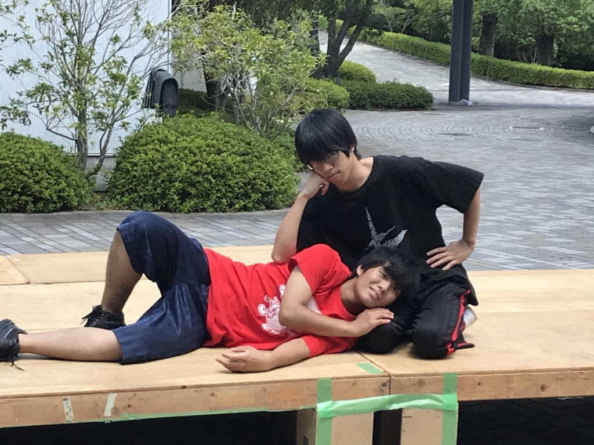
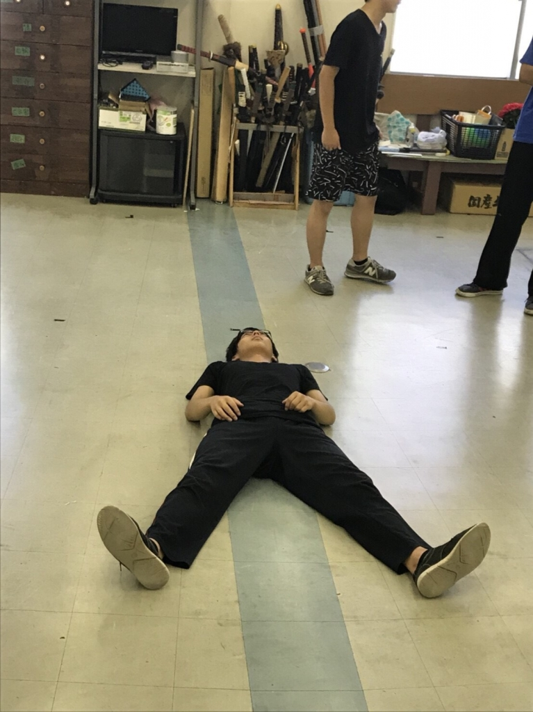

初めましてー、新入生のラギ斗(つんつん)です。実は2回生です。

夏では大道具と小道具を担当してます、今後ともよろしくおねがいします～！！

今日は建て込み稽古でした！大道具さんを筆頭に酷暑の中、朝早くからみんなで舞台作ってシーン回し始まったのですが、もうめちゃめちゃに暑くて、、、結局昼休憩の後はS棟内でシーン回しすることになりました！ガンガン冷房効いてて涼しかったですね～。

そしてこんな夏だからこそ体調には気をつけましょうー、実は僕、試験期間中に夏風邪ひいてしまって、、、ちょうどゲゲルくんの誕プレの読書感想文を徹夜でこなそうとした日から喉が痛くて！もうテスト大変でしたね！ほんとに！

夏風邪は喉にきて、しかも期間が長いみたいです、特に役者さんは気をつけましょう～

8月1日の今日は20時からPL花火ありました！PL花火の会場が富田林っていう場所にあるんですけど、そこ僕の最寄り駅やないかい！！

大阪阿部野橋から近鉄の富田林行きに18:30頃に乗ったんですが、もうめちゃめちゃ人で溢れかえってて、着物人もいっぱいいましたね。

毎年僕も家の窓から花火見るんですが年々規模も時間も減衰していってる気がしますねー。近鉄高いし、めちゃくちゃ混むし、花火は衰退してるし、全然いいことないですよPL花火。

花火といえば夏のキャンプでも花火するみたいです、僕はあのシュバーーッ！ってなる普通の花火を振り回すのが好きです、でも危ないので振り回すのはダメですね。

写真は3回生の小田バーグさんと2回生のデザート風間くんです、とても仲よしさんですね。

これが先輩後輩のあるべき姿ですかね、とても参考になります。参考にならなくても参考にします。

## 夏を超えろ！！！

ブログでは初めてですね。1回のボスメタモンです！

よく「甘い香り」で「耳は猫耳化け物まなこ」を「耳は猫耳化け物なまこ」と言ってしまいます。何がなんでもこの癖を直したいですね！

さて、稽古なんですけど、稽古はいつも楽しいです！ですが、毎回やるたびやるたびに課題が出てくるばかりです。改善していくのはとても大変ですが、この夏を超えれば今まで気づかなかった自分に出会えるのでは…？と思い日々稽古していってます！

写真は1回のさつき君です。彼は寝転がりながら何を考えているのでしょうか…？

