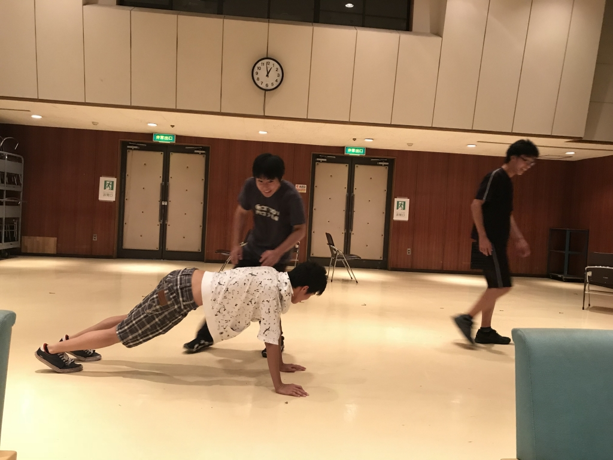

皆さんお久しぶりです、夏公演で総合音響チーフをしている電竜丸です！

いやぁ、去年の夏公からもう1年も経つんですね～、あのふれあい前で2時間ブランコで悩んでいたのが懐かしく感じますね笑

あの時は一回生で上回生に教えられる側だったのに今では新入生に教える側になり、新入生の成長を見るのが最近すごく楽しいです！

特に今年の新入生は去年の僕に比べてとても成長スピードがはやいんですよね！この調子でいくと夏の間に追い抜かされそうです、頑張らないと…(汗

そしてそして、明日は初めてのドレリハです！

普通の通しとは違って衣装があるので気をつけないといけないことがたくさんありますが今年の新入生なら何も問題なくいくに違いないですね！

写真は天使と悪魔というお題のエチュードのワンシーンです！さて、一番前で四つん這いになってるラギ斗(つんつん)はなんの役でしょうか？
