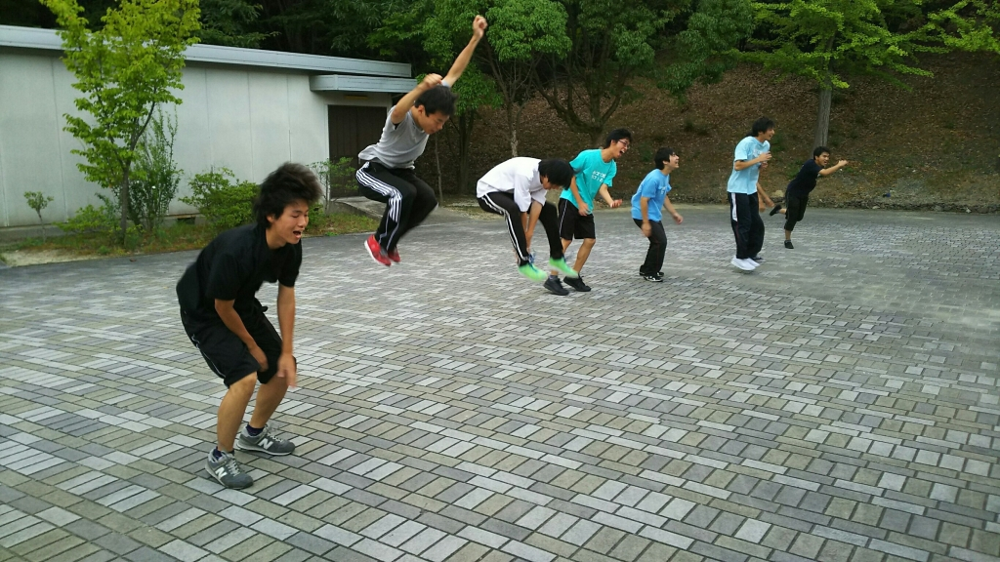

おはようございます！

前回ブログで風評被害にあっているわさびです！違います。オネェじゃありません。そもそもオネェ言葉を始めたのはバーグさんです。新発の役は一切関係ありませんのでご了承ください。

とまぁ弁解はこのくらいにして、、

昨日は久しぶりの学校稽古でした。最近公民館稽古が多かったせいか、壁のない空間がとても新鮮に感じました。やっぱり邪魔するものが何もないところで声を出すと気持ちがいいですね。蚊が多いのが難点ですが笑

そして昨日に引き続き、負け抜けセブンボーズからの罰ゲーム「たるえだ」でした。写真はその時のものです。カルピスは素晴らしい跳躍ですね。えー僕はというと、、1番奥で走ってますね、、、違う！負けたわけじゃ、負けたわけじゃないんだぁぁぁぁあ！！

## 雨がズドドドドドドド！！！

見ろこの空を！天候が空回ってる！

まさに天候のお盆帰りや～

覆水盆に帰らず。

お盆ボンボボン、アイルビーバック。

明けましてお盆終わりました。

ボンヤリしているとあっという間に本番

も終わってしまいそうです。盆だけに。

本日はお盆をひっくり返したような雨が

降りました。これも台風の影響でしょう

か。

しかしこんな雨如きで鎮火される空回り

楽園ではありません！

本日は吊り橋エチュードに挑戦しまし

た。初めてながらも一生懸命食らいつい

てくる新入生たちに先輩勢も負けじと熱

い舌戦を繰り広げてました。

シーン回しが始まってからも役者たちが

方々で熱心に詰めているのを見て、もう

ラストスパート来てるんだなと少し寂し

く思ったりします。

毎年夏公を経る度に同じような気分に駆

られます。まだ終わって欲しくないと。

だけどこればっかりは仕方がない！

後悔のないよう残りも過ごしたいですな！

まさに覆水盆に帰らず！
