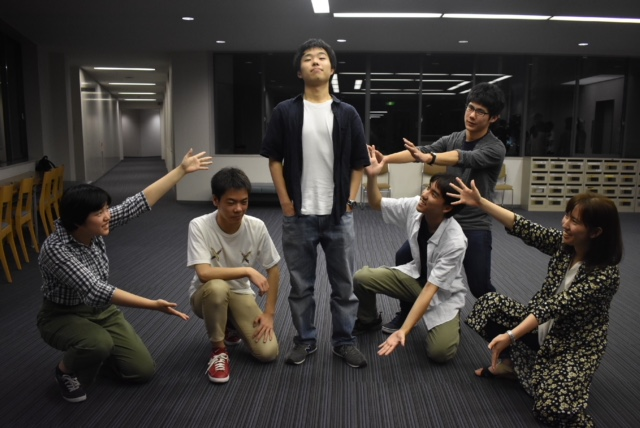

演出務めさせていただきます会長です！

これでうちのチームは初めてのブログになるのですが、役者選考に関してはコツコツとさせていただいておりました！

当初は三日間で決め切ろうと考えていたのですが、もっともっと吟味したいと気付けば四日も選考してました！

発表は本日の打ち入りです！

別段、最後を強く意識したことも無いのですが気付けば最後の夏になりました！

狂ったような暑さがすぐそこまで来ているのも感じます！

この狂った暑さが残暑に変わる頃には稽古して、スイカ食って、水浴びして、遊び倒した日焼けでシャワーがヒリついてることでしょう！

そうして、今回の台本は一つの夏を舞台とした台本です！

自分自身の引き出しを全て解放するぐらいの気で挑もうと思っています！

夏が始まりなのか通過点なのか終わりなのかは人それぞれ想像するものが違うことでしょう！

これから始まる夏を想像するのとこれまで過ごして来た夏を想像するのとでは抱く景色も違うはずです！

ですが、どんな夏を思い描いてもそれらはきっと全て夏なのだと思います！

そして、この作品を見た人の記憶に一つの夏として残るような作品になれば幸いです！

…色々書きましたが鮮明に残る夏にしたいです！

愉快な仲間たちも一緒なのでワクワクは止まりません！！

演出プランから夏の予定まで全部ワクワクです！！

まずは今日の打ち入りです！

牛タンいっぱい食べます！牛タン！

## 甘ったるいアイスキャンディ

こんばんは！４回生のジャンヌです！

最後の夏が始まりました！信じられません！

とりあえず意味わからんくらい楽しもうと思います！！

うちのチームには６人の一回生が来てくれました！

写真左から、ふぇい→ヤッキーD→コロ助→どらごん小次郎→ムージ→しずかちゃん です！

みんな元気で素直でニコニコしてて、ほんとにかわいいです。いい子ばかりです。かわいい。

夏を通してどんな風に進化していくのでしょうか。

ワクワクです。一緒にがんばろうね！

そして今日はうちいりでした！

焼肉モリモリ食べてきたので大満足です！

役者発表もありました！

個人的には何気に初めて同じ場面に出る人もいて、今からシーンを作るのがたのしみです。

まずはがんばって台詞覚えるぞー！

本格的に暑い夏が始まります。

私はアイスキャンディが好きなので最近毎日食べています。

少し溶けてきたころが甘くておいしいんですよね。

７月になればより一層おいしく感じるのでしょうか。

何はともあれ、なにが起こるかわからない、そんな夏へのワクワクをいっぱい詰め込んでこれから過ごしていこうと思います！

OBOGのみなさま、ぜひぜひ、ふらっと稽古場に遊びにいらしてください！

現役生一同いつでもお待ちしております！！
