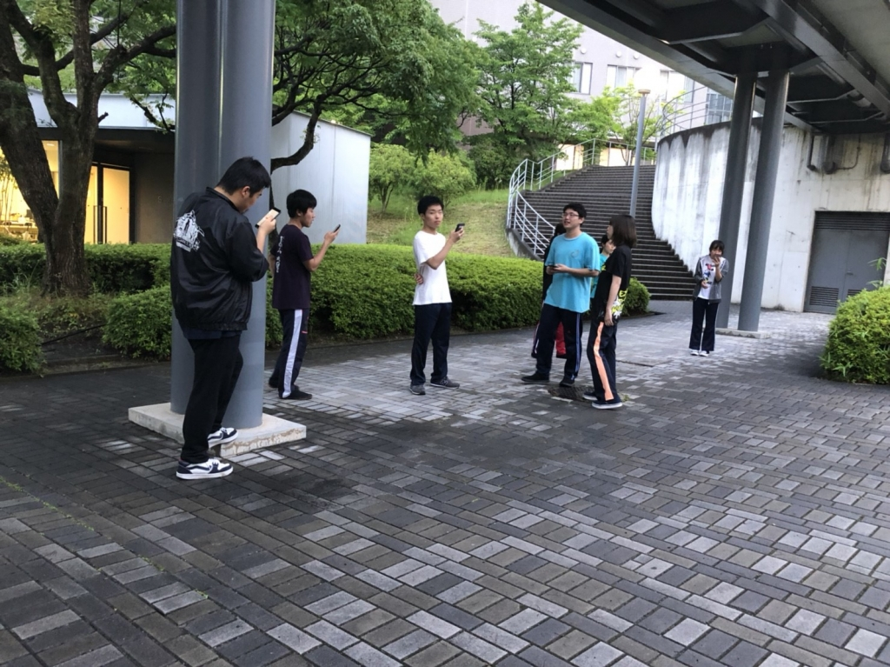

まだ今日の稽古が始まっていないのでセーフだと信じているナタリーです。

最近やっと夏らしい暑い夜になってきましたね。蒸し蒸しして、汗でべたべたするので早く冬になって欲しいものです。

今日は基礎練の時間を長めに取り、一回生に上回生がついて行いました。十分なくらい顔の体操をしたり、ういろううりを読んだりなどなど。

そうえば、一回生の子たちは今日始めてあいうえお回しをやったんですが、ほとんど詰まらず言えている子もいたので吸収力がすごい！と驚きでした。最近の子は物覚えが早いです。これはセリフ覚えも上回生より一回生の方が早いかも…？
