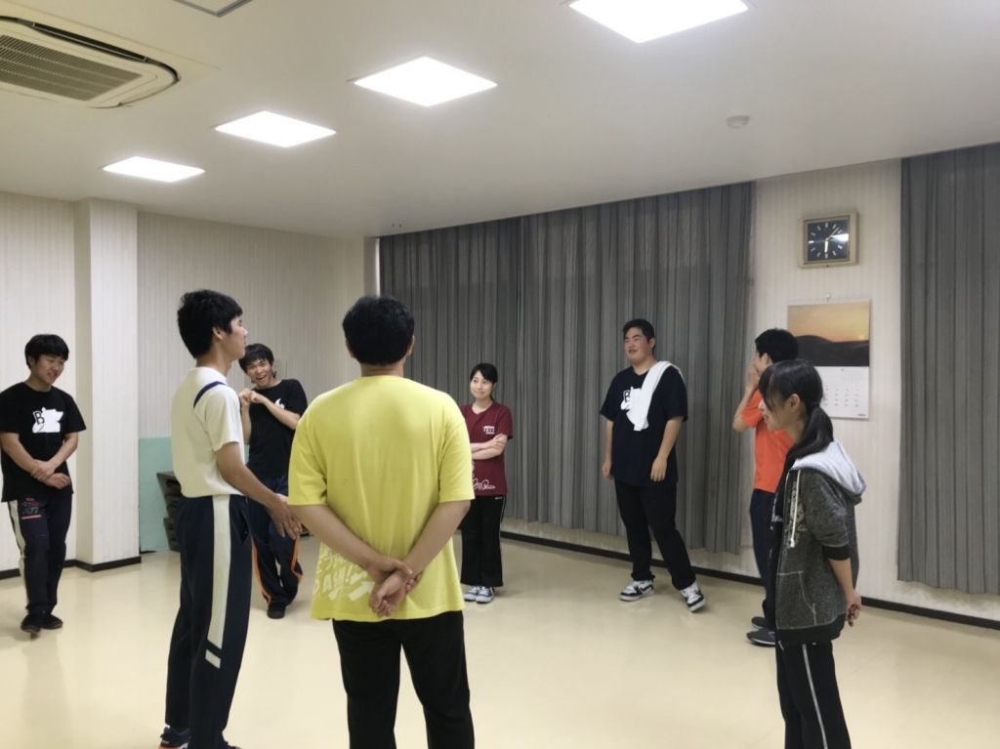
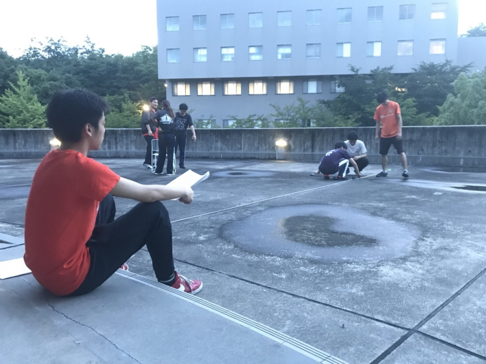

## ドドドォー！！！

こんにちは。

本日の担当は4回生のあおいでございます。

さて、時の流れとは早いもので最後の夏がやって参りました。

久々に役者、久々に台詞があるので覚えられる自信が無いです(笑)

本日は1回生があめんぼと甘い香りを覚える時間がありました。

一部のグループでは先輩が体育部の如き熱血指導を行う場面も…！

最後には自主的に暗記対決をする姿も見受けられました。

代理戦争の如き絵面であったことはまた別のお話…(笑)

1回生の子は短時間で覚えてて優秀だなと感心しました。

上回生も負けてられませんね！まずは台詞を覚えねば…。

このブログタイトル「ドドドォー！！！」は、今年のカープのスローガンです。

いやぁ、正直何を思ってこのスローガンにしたのか意味わからないしキチガイだと思いますよね。私はキチガイだと思いました。

今年はこのスローガンに乗っ取り、キチガイに騒いで楽しみたいと思います！！！

## 回転寿司

こんばんは！！！栗田です！！！

夏は楽しいですね！！！！

わくわくしますね！！！！！！！！！

さて、今年の1回生なのですがめちゃくちゃスペック

が高いです！！！！

もう、あめんぼや甘い香りを覚えた子がでてきました！！

シーン回しでも、遊びを入れてくる子がいたりして

将来有望だなと思いました！！！！

！をつけすぎると情緒不安定って時雨が言ってましたよ。

！をつけなくても、あいつは情緒不安定なんですけ

どね！！！！

写真は舞台を作っている写真です！

座っている子はヤッキーDなのですが、演出みたいですね！！
