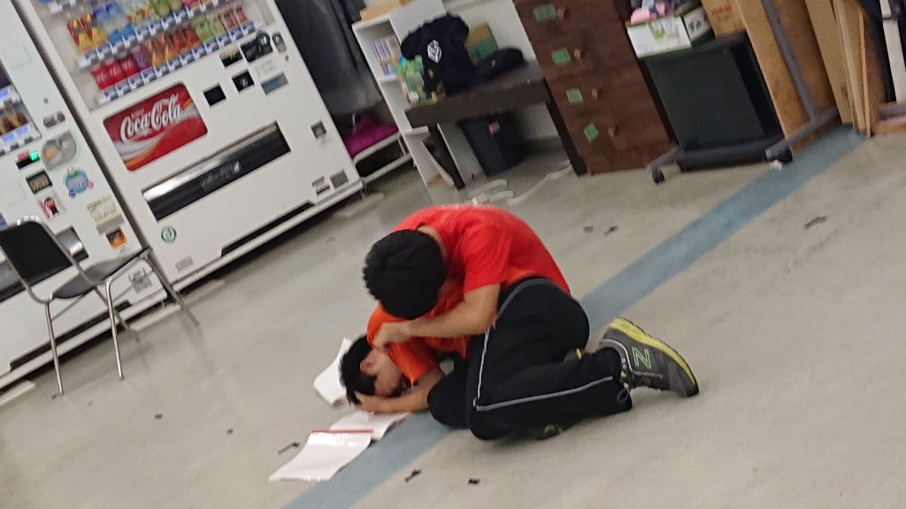
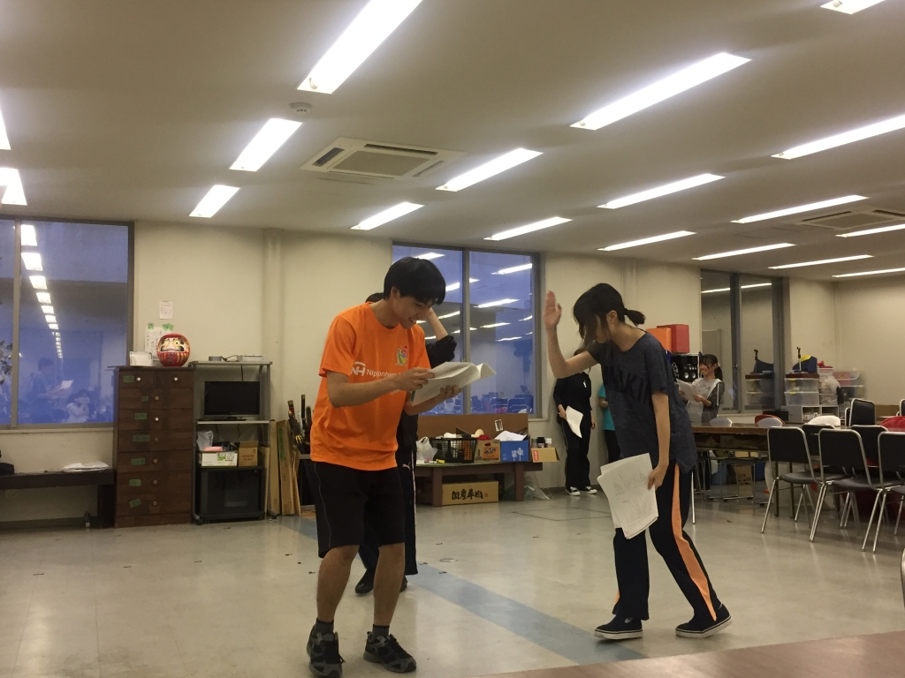

こんばんは！

稽古でとある先輩と一緒に(？)順調に知能指数が下がってきているフォーミュラーです！

今日は久しぶりの稽古でした！大雨やらで稽古中止など重なり、自分にとっては実に6日ぶりの稽古になりました。

久しぶりの基礎練、シーン回し楽しかったです！楽しい！ただ1回生と稽古しているとあぁ～先輩になってしまったんだなぁとしみじみ感じます。1回生の子はみんなすごく稽古に熱心で、順調に台本も覚えてきていてすごいなと思います！覚えなくちゃ！！！！

さて、そんな明日は荒通しです！がんばるぞー！

写真は倒れたコロ助と寄り添うデイビッドです(適当)

## 荒通し

暑い日が続きていますが、皆さまいかがお過ごしでしょうか？暑いのは苦手だなーと思いながらも梅雨が明けてうきうき気分のDJかおりです。

今日の稽古は荒通しでした。地球さんの機嫌が悪かったせいで稽古不足かも…役者も不安かな…とも思っていたのですが、そんなことを微塵も感じさせないパワフルさでした！

特に一回生の成長ぶりがすごかったですね…！ちょっと見ない間にメキメキ成長してます！本番までにどこまで伸びるのか楽しみですし、その成長を間近で見られるのが嬉しくて仕方ないです！これは上回生も負けないように頑張らないとですね…！

以上、久しぶりに万絵巻のみんなと会えてるんるんなDJかおりでした！

p.s.写真は一回生にヘコヘコする時雨ちゃんです(本編にこのようなシーンはありません)
