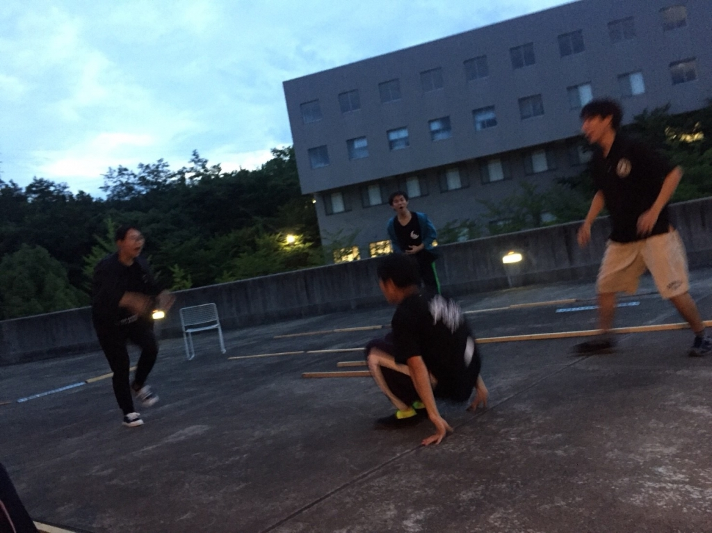

こんばんは！

この夏総合制作チーフを務めることになりました、みゃーです。

役者は新歓ぶりにやります。

ここ最近、地震や大雨の影響で稽古がなくなったことも多くあり、大変だったと思います。

そんな中、今日は昨日の荒通しを終えての稽古となりました。

私としては、久しぶりの稽古でしたが相変わらず楽しくすることができて、稽古を楽しんでます笑

1回生もあめんぼや甘い香りを覚えるのが早くて、優秀だと思いました！！！

これから、どのように成長するのかとても楽しみです！

そんな夏の稽古ですが一番厄介なのが、日焼けと虫刺されです！

特に、最近は蚊に刺されることが多くて、稽古の合間にウナを塗ってますが、、、

まぁ～、かゆいです！！！！！

日焼けは日焼け止めを塗ればいいのですが、虫刺されはウナを塗ってもどうしようもないです。それがあまりに嫌で、虫除けスプレーを衝動的に買いました！これでなんとかなればいいのですが、、、。

今年の夏は、そんな葛藤を抱えながら頑張りたいと思います。

今日の写真は、ハイテンションエチュードで踊りまくって盛り上がっているシーンです笑
