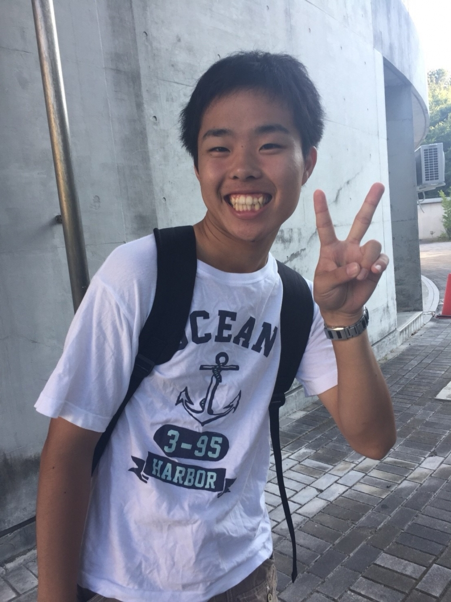

初めまして！！

一回生のコロ助です！！

広報と大道具を担当しています。

この前は写真だけでした。

誠にすみません。

なぜだろう.....

それより、今日は昨日に引き続きパンフ撮影でした！！

今日はとにかくたくさん撮りました！！

みなさん、楽しく写真を撮っていました！！

最近、本当に先輩方の素晴らしさを

身に染みて痛感します。

目指す目標ができて本当にわくわくします！！

そして！！！！！

明日から3日間キャンプです！！

海に行ったり、みんなでご飯を作ったり

楽しみ満載なことだらけです！！

声優は高橋李依さんが好きなコロ助でした！

## 最近気づいたこと

いよいよ一回生の紹介となりました

最後にかざるのはムージです

芸名は自分オリジナルのものがいいと考えてつけました。

大学に入学して4ヶ月が経ちました

公演に向けての稽古はなかなか慣れないものです。

早口言葉、活舌やケツカミなどの基礎がとても大事だと台詞回し、通しをするたびに感じてきました。

指摘されたところ、癖を直すのが難しいと感じました

例えば僕は昔は机に座る時に足を組んでいましたが今は組むことはほとんどしなくなりました。

それは先生に悪い行為だと指摘を受けて直す気持ちがあったからだと思います。

稽古の時も同じように指摘されたところはしっかり直していこうという気持ちを胸に本番まで頑張っていきたいです。

話が変わるのですが最近楽しい、面白いと思うことは期間があいて何かするもしくは何か発見したりすることです。

例えば久しぶりにテレビを見たり(自分の中ではクイズ番組やバラエティー番組を見ること)

店に行って新しい商品を見たり、アクエリアスマルチビタミンがペットボトルで売ってなくても水とマルチビタミンのパウダーが売ってれば飲むことができることです

長々と書き過ぎてしまいました

明日は皆さんが楽しいと太鼓判押しのキャンプです

体調を崩さないことを願います

以上で終わります

iPhoneから送信
