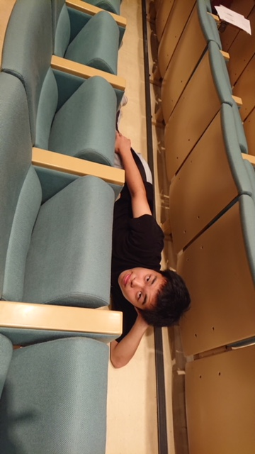
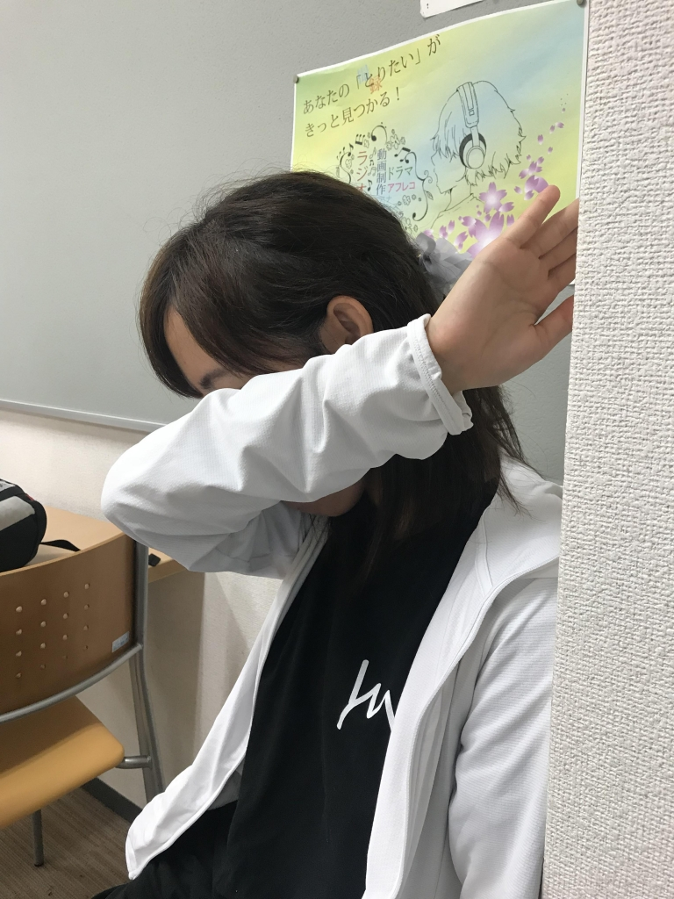

厳しい暑さが続きますが、みなさまいかがお過ごしでしょうか。2回生マッシュです。ブログ忘れてました。

昨日の稽古は、2時間たのしく基礎練をしてからのシーン回し。1回生とアメンボダッシュを研究したり、エチュードでは演出さんによる選抜メンバーで正しいエチュードを思い出す回が開催されていました。基礎練テンション高すぎてちょっと引きました。

平スタッフとして公演に参加するのは初めてで、またいつもと違った見方ができてとても楽しいです。

稽古場でいちばん驚いたのは、同期の成長でした！演技力はもちろん、後輩に教えてあげる上回生としての姿に頼もしさを感じます。

元気な上回生とかわいい1回生、残りの期間でみなさんもっともっと成長するんだと思うととってもわくわくします！本番をお楽しみに！

写真は演出さんに隠れて稽古をサボる1回生です。余裕の表情ですね。

## 8月後半！

こんばんは。

フォーミュラーです！

気づけば8月稽古の後半が始まっていました。はやい。今日は学校稽古でした！雨が降ったりやんだりで稽古場所を転々としていました。

今日は自分が出ているシーンが多くまわり、まだまだ詰めていくところが多いと思いました。がんばります！明日はドレリハです！！！！！

今日の稽古には21期生の夜王さん、ほのかさん、大和さんに来て頂きました…！ありがとうございました！！

写真は今稽古場(一部)で大旋風を巻き起こしている〝ウッヒョイ! 〟の片鱗をみせるしずかちゃんです。ウッヒョイ!
