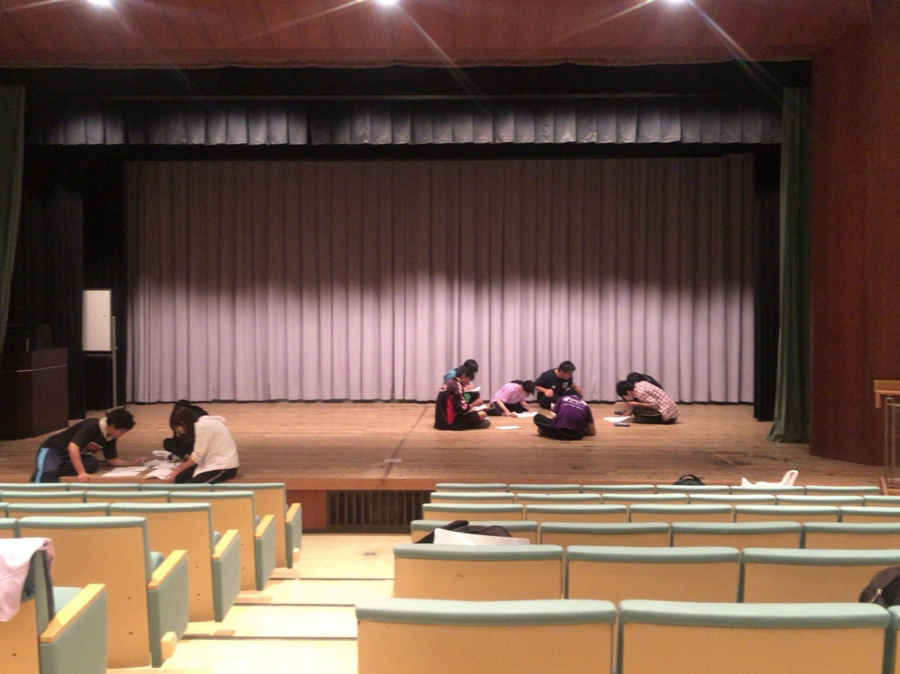

こんにちは。

4回生のあおいでございます。

夏も大詰め光陰矢の如しです。

昨日のドレリハをふまえ、

今日は台本を読み直して情報共有を行いました。

改めて議論すると思いがけない

発見があったりするものです。

脚本の面白さが伝わるよう頑張らねばと

身が引き締まる思いです。

今日は稽古場に21期生のみつあみさんとりんさんがいらっしゃってくださいました…！

ありがとうございます…！

さて、最後にブログタイトルについて。

山田ファミリーの中ではとある言葉が

流行しております。

間違いなく山田ファミリー流行語大賞と

言えるでしょう。

昨日の通しの前もこの言葉で気合を入れました。

流行語となるきっかけを作ったとある後輩ちゃんの一言

「私が流行語大賞」

流行語で一皮剥けた山田ファミリー構成員

全員で作り上げる夏の大舞台。

お客様に楽しんで頂けるように残り少ない夏を

駆け抜けていきます！
