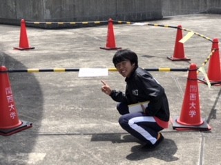

こんばんは！

皆さん、お盆休みはどのように過ごしましたか？私はお盆ラッシュの時期に帰省してゆっくり過ごしていました！(サボりじゃないです笑笑)

今日は、一週間ぶりに稽古に行きました。

基礎練やシーン回しを見ても、一回生に大きな成長が見られたので、嬉しいです！！！

稽古日もあと7日ということで、本番に向けて努力してる次第であります！

私は遅れをとってしまった分、しっかり稽古に励みたいですね……。

久しぶりの稽古もあって、外は相変わらず暑いです！そんな暑い中でも、山田ファミリーは元気よく活動してます！

そんな姿を見て、明日も頑張ろうって気持ちになりますね！

明日は一日稽古なので、倒れないようにしないとですねー！

今日の写真は、L棟の立ち入り禁止区域近くにいるデイビッドです。

一体何をしているのでしょう……？

以上、前回のブログで蚊に刺されやすい体質になってしまったみゃーでした！
