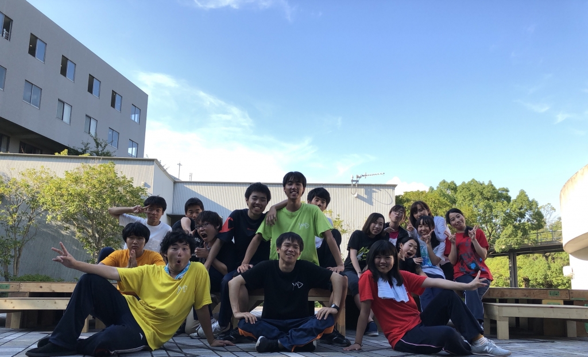

おはようございます、４回生のジャンヌです！

あっという間に最終稽古がおわり、今日から小屋入りです。

昨日の稽古では久しぶりにセブンボーズ負け抜けをしたのですが、はじめて勝つことができました！うれしい！

回生エチュードでは個性が爆発していてお腹がよじれるほど笑いました。

また、シーンの細かな段取りを詰めたり、場面転換を整理したりと、最終稽古らしい稽古でした。

最後にはテラスで集合写真を撮りました！

みんながわちゃわちゃしてるのが面白くて、撮るのがたのしくて、気づけば１００枚くらい撮っていました笑

話は変わりますが、わたしは昔、カメラが好きな女の子の役を演じさせてもらったことがあります。

３年前の夏のことです。

それ以来、自分自身も写真を撮ることが好きになりました。

中でも万絵巻の人たちを撮るのが一番好きです。みんなすっごくいい顔してるんですよ。稽古でも、舞台上でも。夢中になっているみんなを、夢中になって撮っている時が幸せです。

わたしはドンくさい人間なので、この夏、１回生と仲良くなれるかなとか、後輩とうまくやっていけるかなとか、いろいろと不安はありました。

今となってはそう思っていたのが嘘みたいです。

チームのみんなが大好きで、もっともっと一緒にいたいなって思います。

眼を閉じるとカメラごしに見てきたみんなの姿が浮かびます。

あ～～～～はやかったな～～～～～

むちゃくちゃたのしかったな～～～～～～

あ～～～～夏おわってほしくないな～～～～～～～

山田ファミリーの夏公演、総勢２４名の良さがギュッと濃縮されています。

観ていただく人に届けるため、台本と向き合い試行錯誤を繰り返してきました。

詳しいことは本番にとっておくため言えませんが、、、ぜひぜひ観に来ていただきたいです！

お待ちしております！！！

p.s.写真は、おとつい建て込んだ舞台で撮ったものです。

いつもお昼ご飯を食べたあと、くつろぐために人が集まっていました。山田ファミリーのお家です&#127968;
