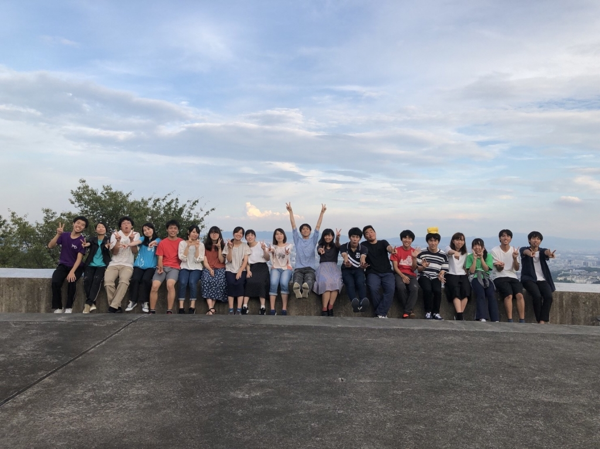

## 9月

お疲れ様です！会長です！

今日がもう本番です！

早いという感覚は年を重ねるごとに感じていたのですが今年はやっぱり何だかんだ不思議な感じでした。

残りの稽古日数が減ってく中でも特に実感が湧くこともなかったのですが、最終通しのラストシーンを見ていると不思議と今までよりも景色が輝いて見えました。

寝不足でコンタクトもしょぼしょぼだったのですが、その時にはすごくすごくピントが合って、日差しが眩しくて、シーン自体もゆっくりゆっくりと流れていくような感覚でした。

これがようやく実感した、夏が終わる予感でした。

今思えば、僕の"夏"は一回生のころから終わることなくずっと続いていたのかなと思います。

一回生の夏は楽しくて楽しくて、二回生の夏には後輩が出来て自分も先輩になって、三回生の夏には一つの中核を担って、どの回生の時でも確かに始まりと終わりはあったはずです。

けど、それでも終わりの瞬間にまた来年を感じていたのだと思います。

だからこそ、永遠に続くと思っていた夏が終わることにさみしさを覚えました。

僕にとって"夏"は楽しいものでした。

楽しいからこそ、"楽しい"に悩むこともありました。

何をもって楽しいとして、楽しくないとして、それを考えて、動いて、結局正解が何なのかは出ていなかったことだと思います。

そういう風に、永遠に続く夏が課した宿題にとうとう今年は答える年だったのかなと。

眩しいと感じた景色を見たとき、さみしさだけじゃなくて、よかったと感じられたことは間違いじゃなかったはずです。

僕はようやく宿題に答えることが出来ます。

楽しいことは互いに笑い合うこと。

楽しいことは互いに高め合うこと。

楽しいことは互いに間違いを言い合うこと。

楽しいことは互いに許し合うこと。

楽しいことは…、楽しいことは…、

…書き出すと終わりがないです。

人に100%伝えられるかも分かりません、自分の中だけのものだけかもしれません、それでも僕は胸を張って"楽しい"を知ったと言えます。

書きたいことを書くとやはりぐちゃぐちゃしてしまいます。

ですが、もう少しだけ書きたいと思います。

この夏、少なくとも他のチームメンバーが楽しいと感じていたのならば幸せなことです。

僕は楽しかったです！

声を高らかにして、共に歩んでくれたチームメンバーにありがとうと言いたいです！

君たちのお陰で、最高の夏にすることが出来た！

君たちが最高の夏を作ってくれた！

ここまでよく頑張ったよ！

本番も頑張ろうね！！

この夏の数ヶ月、死ぬほど楽しかったよ！！！！

ぐちゃぐちゃのまま締めくくることにはなるのですが、僕たちの歩いた一夏、ぜひ楽しんでいただけると嬉しいです。

ご来場、心よりお待ちしております。
