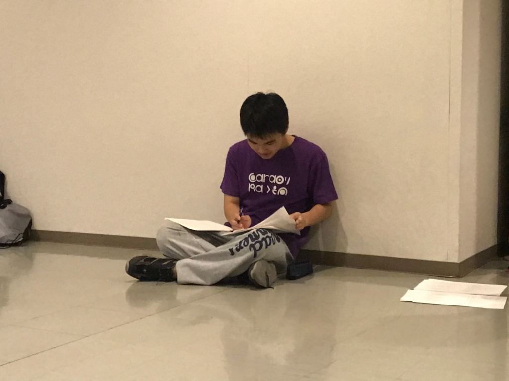
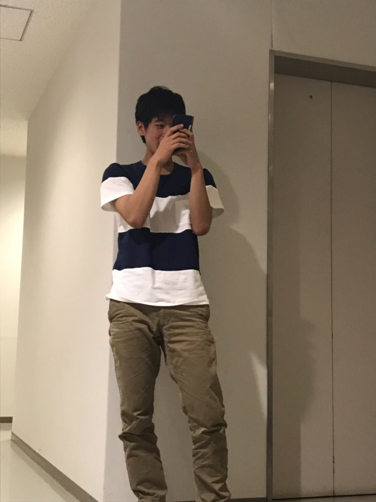

最後の夏です。

４回生のかごめです。

今回、実に１年半ぶりに役者をすることになりました！

まぁ、ものの見事に基礎練に何をするのかなどをすっかり忘れ去ってたのですが…

甘い香りとかアメンボとか1回生よりはまっしといった具合です。

ですので、４回生ですが1回生と共に一から役者として頑張っていこうと思います!!

まだまだ、わさびチームは役者選考中です！

1行ずつ読む人を代えていくやり方が新鮮でした！

稽古がめっちゃくちゃ楽しいです！

どんな役になるのか、今からワクワクします！

これから、頼りになる同期、成長が楽しみな後輩たちと頑張っていきたいと思います！

以上、甘い香りを忘れ去っているかごめでした！

どのシーンをまわすか考えてる演出です。

## 来ちゃったよ～～ん

こんにちは、こんばんは

2回生のさつきです

夏のチーム発表からちょうど1週間が経ちました

僕はわさびさんのチームに入りましたが

なんだか去年と同じ匂いがします

あの暑苦しい楽しい感じが役者選考をしているだけで感じてきて

今からがすごく楽しみです

今年の1回生は本当に本当にキャラが濃すぎます面白すぎます

役者選考でも笑いをこらえるので必死です

1回生同士も仲良すぎるぐらい仲がいいので

見ていてとても微笑ましいですね

稽古場の様子はというと

僕はずっと笑ってます

いや、笑わずにはいられません

毎回稽古が楽しみ過ぎるって思える稽古場ですね

これから2ヶ月と少しこのチームで全力で走り抜けて

一回生が心から楽しかったと言える夏に

そして僕自身も最高だったと言える夏にしたいと思います！

写真はやりたくない役と言いつつ立ちあがって読んじゃう1回生のキングです！
