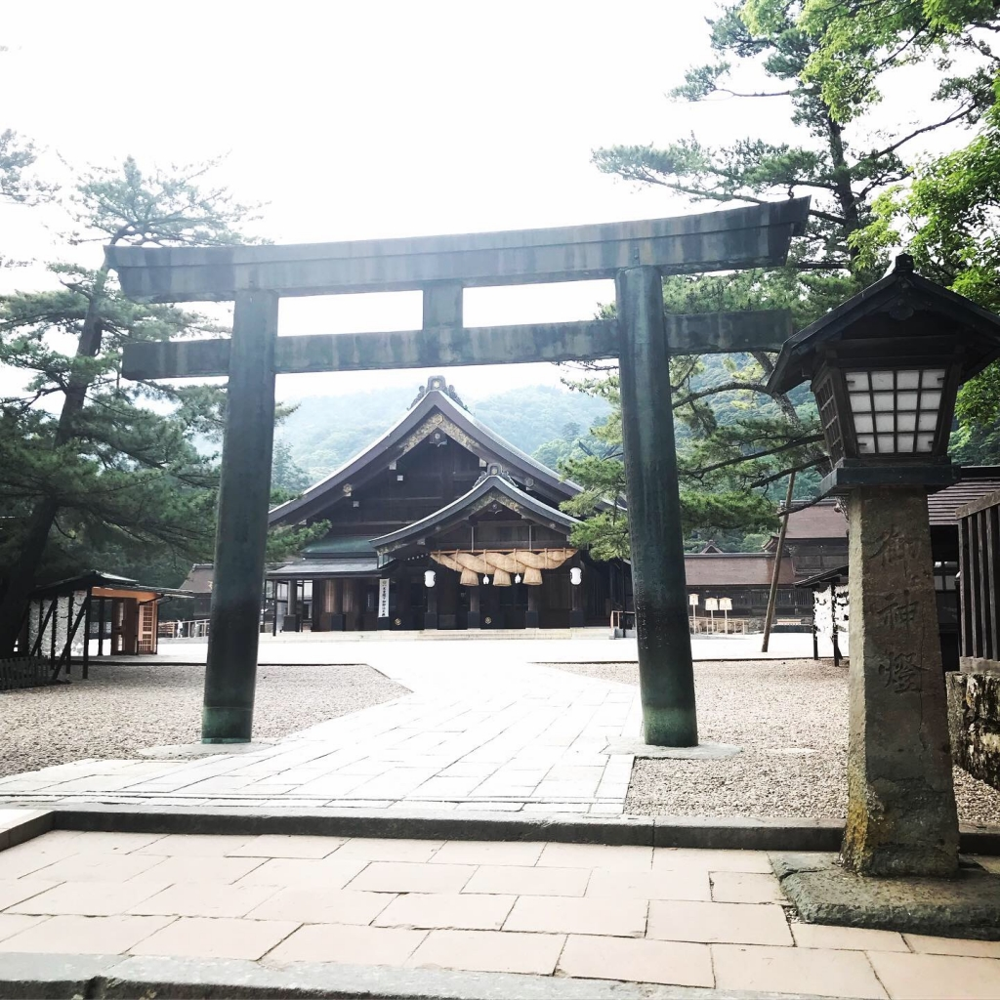

おはこんばんちわ

どうも、ノンベジ・JK・花夏流です。

ぼくのなつやすみが早めに始まった気分です。

島根に行って来ました。

突貫日帰り旅行です、すっごーい大学生してる感あります。やっぱドライブって良いですね…

ドライブに行く前にかなめさんがの家に泊まったんですけど和室でして、昔ながらの扇風機もありまして、外でカエルがゲコゲコ鳴いてるのがまた風情を感じました、夏到来って感じ

島根って田舎すぎて街灯がほんとなくて光って大切だなって思いました暗闇に勝つために文明を発達させて来た人類は本当にすごいと思います。

これは出雲神社の写真です！
