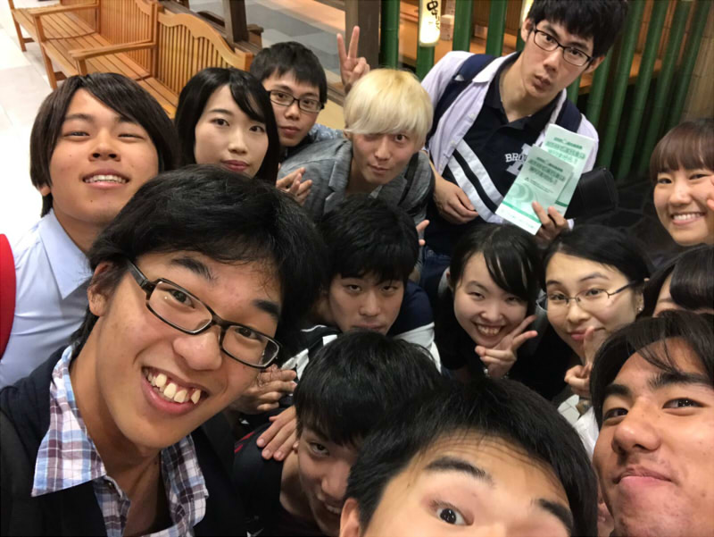

こんばんは、環状線に揺られながらブログを書いてます、4回生のかなめです。

揺れるで思い出しましたが、声優の竹達彩奈さんが梶裕貴さんと結婚したそうですね、おめでたいですね。

さて、本日はうちいりがありまして、串家物語に行ってまいりました。

串をあげるという行為が面倒だなと思って、実はあまり好きではなかったんですが、普通に美味かったので、今日から好きになりましたね。単純な男ですね。

先程書いた通り、かなり面倒くさがり屋なんですよね。串をあげるのもそうですし、同じような理由でとうもろこしや、エビ、魚があんまり好きじゃないんです。

味は普通に美味しいと思うんですけど、いかんせん食べるのに対して一手間かかるとダメですね。

なので、見た目はいいのに性格が面倒な女の子はとうもろこし系女子という新しい言葉を思いついたこともありました。

閑話休題。

おめえ閑話休題って書きたかっただけやろって思った方いると思いますが、まったくもってその通りです。

うちいりで役者発表をしたんですけど、同じテーブルの人らはみんな第一希望が通っていて、よかったです。

高校受験でもみんなが第一希望に受かってて、1人だけ滑り止めのところだと気まづいですもんね。

あ、ちなみに僕は今回も役者ではなく、音響オペをやらせていただきます。

びっくりすることに三年連続、音響 小道具 チーム舞監という役職になってしまいました。

初めは小道具だけするつもりだったんですけど、おかしいなあ？

でも最後の夏なんで最高に楽しもうと思ってるんですよ。基礎練にも三年ぶりに参加したり、エチュードやセブン坊主、たこ8にも混ざったりしました。

久々にエチュードをするとほんとに何をしたらいいのかわからなくて一瞬で出番終わってしまったので、エチュードでの目標は一番最初に出ることになりそうです。

ここまでみてくれてる人はあんまりいないと思うのでぶっちゃけることを書きます。

何故か今回のうちいりで一回生に、ラブホテルに入ったことがあるという暴露話をすることになりました。

(ここでブラウザバックしないでくださいね。

ここまできたら最後までみてくださいね。)

それがまだ4人くらいのテーブル席ならまだいいんですけど、その一回生が解散の時にでっかい声でその話題を出したのでかなり焦りました。

まあ誤解を生まないように種明かしをすると、派遣のバイトが二日間あって、遠くに行ったときに、泊まるホテルがラブホテルだったっていう話なんですけどね。

はい、閉廷。

まあ何はともあれ一回生がこの夏楽しんでくれたらいいなって思います。

その為にはまずは自分が楽しまないといけないので、最高に楽しもうと思います！
