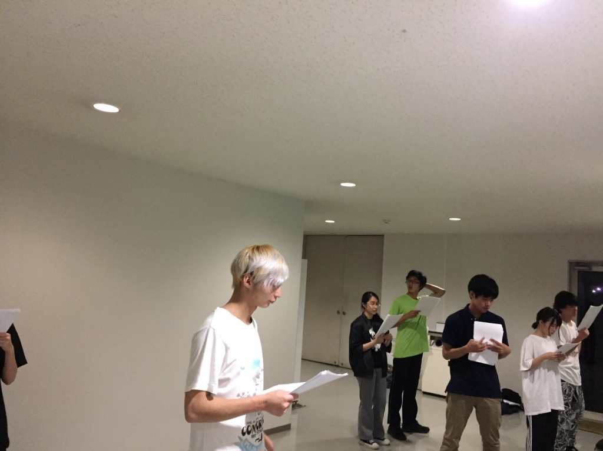

はじめまして １回生の書記です。

ブログを書くというのは初めてで、何を書いたら正解なのか全然分からないのでハブられメタルくんに倣って自己紹介のようなものをしたいと思います。

書記という芸名の由来は『かぐや様は告らせたい』というアニメの、藤原書記というキャラの名前と本名の名前が同じだったからという理由でつけてもらいました。藤原書記可愛いですね

あとは身長が低めで体が柔らかいです。あと絵がかけます。それとアドリブにすこぶる弱いです。

…自己紹介が終わってしまいました

まだちょっと短い気がするので演劇の話をしようと思います。

私は高校生の時、1年間だけ演劇部に所属していました。学校に演劇部がなかったので高2のとき友達と作ったんですよね。新入部員が1人も入ってくれなくて1年でその部は潰れちゃいました。部室もなければ顧問も来ない 部員みんなで脚本を作って、みんなで大道具を作って、みんなで演出を考えて…そんな感じの演劇部でした。このスタイルが嫌だった訳ではないし なんなら好きだったんですけど、今のサークルに入ってから、作業を分担してる所や 舞台の設営だったり 設備・機材であったりを見ると、当たり前だけど高校と違ってどこをとってもめちゃくちゃ団体としての土台がしっかりしてるなぁって日々感動しています。こんな恵まれた環境で演劇ができることがすごく嬉しくて、大袈裟ですけど最近とても幸せを感じています。 先輩がいるってだけでなんかもう安心感が違いますね

気づいたらそこそこ長く書いてしまいました。

とりあえず めっちゃ面白いとか美声とかそんな突出した武器は何も無いですが、個性が強すぎる同期のみんなに埋もれないよう頑張ります。

写真は本日の稽古の様子です
