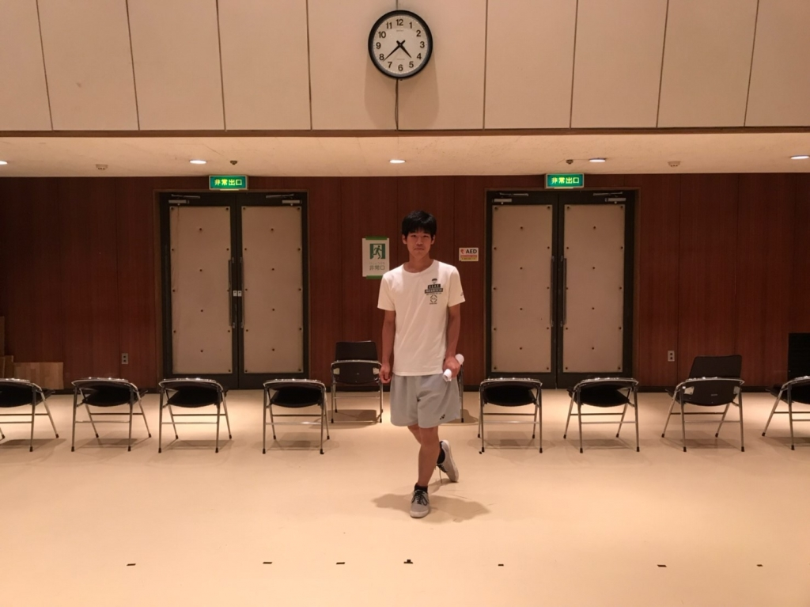
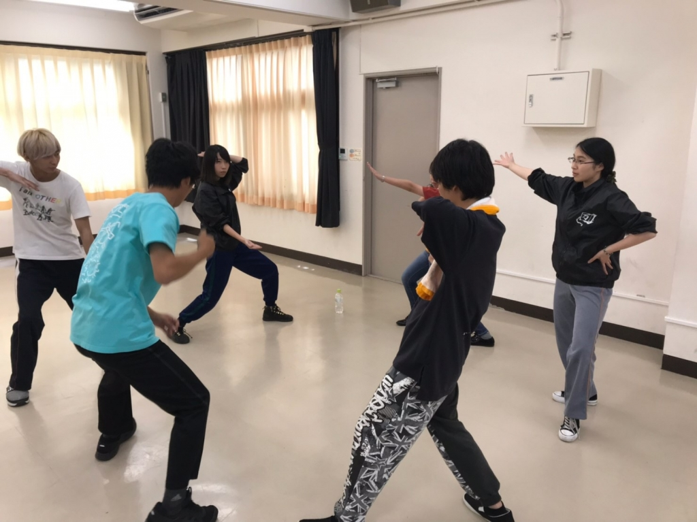

こんばんは！

昨日荒通しだと思い、カメラと三脚を持って行く気満々だったんですけど、演出さんから明日に延期すると言われてドタキャンされた気分になった、3回生のみゃーです。

このチームのブログでは初めての登場になります。

ブログを書くのは久しぶりなので、何書いていいか悩んでしまいますが、タイトルにも書いてる通り、荒通しは明日に延期となりました。

でも、久しぶりに稽古を見に行くと本当に楽しくて笑ってばっかりいました。

今回、私は初めて役者ではなく平スタッフとしてこの夏を過ごします。

今までは役者をしてたので自然と一回生と触れ合うことができてたのですが、スタッフになると稽古行く頻度が少ないので、仲良くする機会が減ってしまいますね…。

ちょこちょこ稽古場に顔を出すようにするので声掛けてくださいね…！

また今日は、稽古場に22期生のテグラルさんとドクトルさんが遊びに来てくださいました！

久しぶりの再会だったので、稽古場行ってよかったって思いました！

あと、一回生が凄まじい勢いで成長してるなぁって思ってびっくりしました！あめんぼダッシュを初めてしたのですが、あめんぼをしっかり覚えてて、成長を実感できたのでこの夏が楽しみです。

役者として関われないですが、稽古場を撮影しながらこのチームに関われたらいいと思います！これを私の目標に頑張ります！！！

写真は、可愛らしいポーズをとってるキングヨネックスです。

## 第1回荒通し！！

どもどもどーも！はーじめまして～

1回生の太宰晴吾です。イケメンな名前ですが女子です。

1回生はみんな自己紹介してるので、荒通しのお話の前に私も語っちゃおうと思います！

まずこのかっこいい芸名なんですが、私が漫画好きだという理由から『文豪ストレイドッグス』の【太宰治】と『Im~イム~』(←イチオシ漫画)の【御空晴吾】の名前を繋げて現在に至りました。好きなキャラの名前だからというのもありますが、なにより先輩から名前を頂戴したというのが嬉しくて、大変気に入っております！

今回の夏公演では、大道具・小道具・衣装、そして役者をやらせていただきます。これまで演劇とは無縁の人生を送ってきた私ですが、そんな私がなぜ今演劇をしているのかと言うと、単純に『万絵巻』に惚れたからなんです。先輩がいい方達ばかりだとか、とにかく惹かれる魅力をたくさん感じました。演劇の世界へ足を踏み入れてまだ2ヵ月余りですが、毎日が刺激的でとっても楽しい！！先輩方と同じ舞台に立つのはなかなかに緊張するんですが、それ以上に皆さんの個性光る演技と熱意に感化されて、胸踊る毎日を過ごしております。この夏は胸を張って「自分！成長！！した！！！」と言えるようにしたいです。

さてさてさーて！やっと本題！荒通しについてです！私個人の感想といたしましては、緊張してハケを間違えたり、自分のセリフの番にタイミングよく話し出せなかったり…と反省点をあげるとキリがない…！という感じです。改めて舞台で役を演じ続けることの大変さを知ることができました。通し後、先輩方に丁寧にダメ出しをしていただきました。ありがとうございます！！次の荒通しまでに今回の反省点を改善していきたいと思います！

写真は私が差し入れした広島土産の余りをかけてセブンボウズをする先輩方です～(1回生とわさびさんは脱落済)

本日もお疲れ様でした！！
