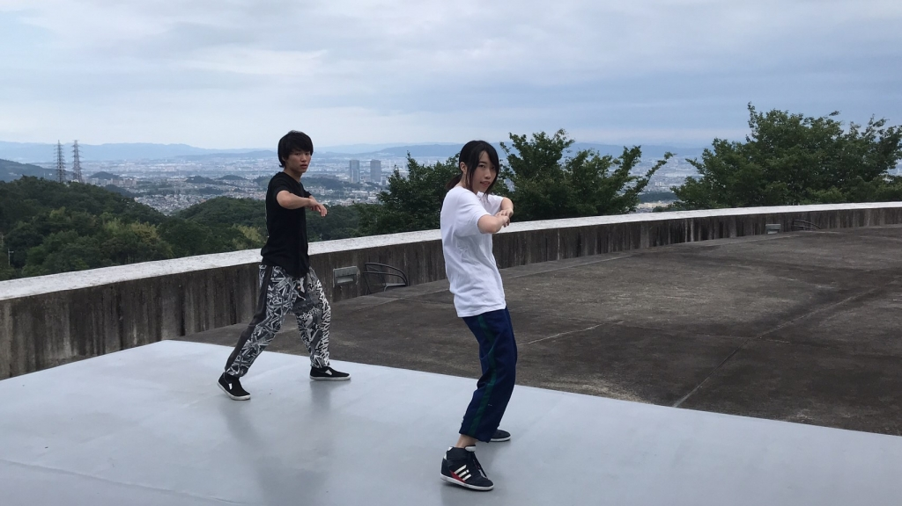
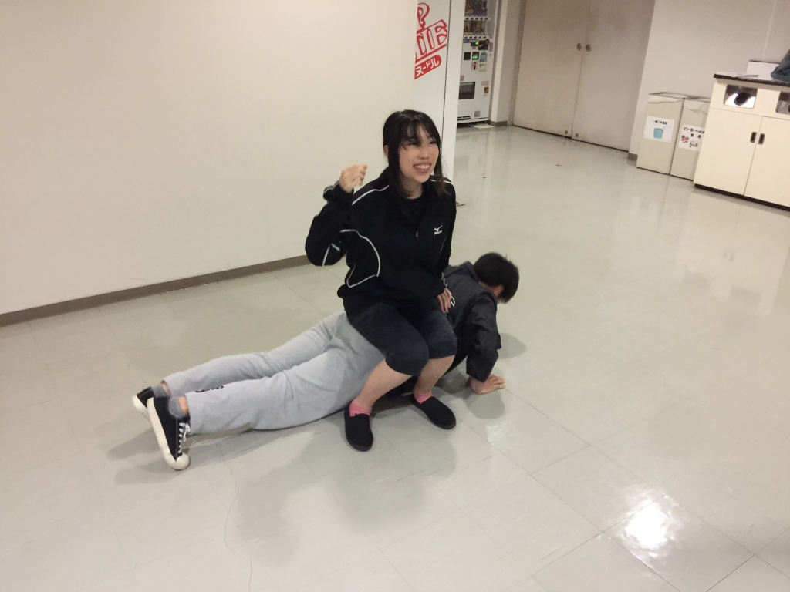

こんにちは、時雨です。

昨晩は珍しく早々に寝てしまったのでブログの更新をうっかり忘れていました。

というのも昨日はパフォーマンスの振りを考えて踊りまくったので疲れてしまったんですね、身体のあちこちがバッキバキです。

ブログの更新が回ってくるのが早い！ので特に書くことが思い当たりません、どうしましょう。

そう言えば最近、朝になると蝉が鳴いてることに気がつきました。

7月ですものね……本格的な夏の到来を感じます。

夏という季節がどうにも苦手です。

別れの季節といえば春、とはよく言われますが個人的には夏の方が別れの季節の印象が強いですね。何故でしょう。お彼岸とかあるからでしょうか。

夏独特の香りを吸い込むと鼻の奥がツンとするような感覚に陥ります。

そういう時はマキシマム ザ ホルモンを聴けば万事解決します。アガります。

逆にガガガSPやサンボマスターなんかは駄目ですね。涙腺が崩壊してしまいます。

それと夏といえばORANGE RANGEですね、上海ハニー大好きです。

なんとか文章が埋まりました！えらい！

個人的夏ソングはガガガSPの「忘れられない日々」な時雨でした。

## 演出はもちろん役者もすごい

＊ わさびさんが罰ゲームとかでなった状況ではないです。

お疲れ様です およそ半年ぶりにブログを書くことになったムージです。

夏公演開始からもうすぐ1ヶ月が過ぎようとしています。 通し日に向けてみんな頑張っています。

今日は役者同士であるシーンの動きを合わせていました。 3つありどちらも一回生が大きく関わるシーンでした。 １つは上の写真が関わっています。これは去年の夏にも似たようなシーンがあったような～と思い出せさせてくれました。

演出や上回生が一回生に助言すると一回生はすぐ改善するのを見てのみこみが早いと僕は驚かされてばかりでした。 演出のすこしの助言でとても役者の動きがよくなっていました。

今日見学して思ったことはシーン終わりのダメ出しやよかったところを聞いて理解できることも演劇の面白いということです。

今日注目した２つはふせときます。 以上です。
