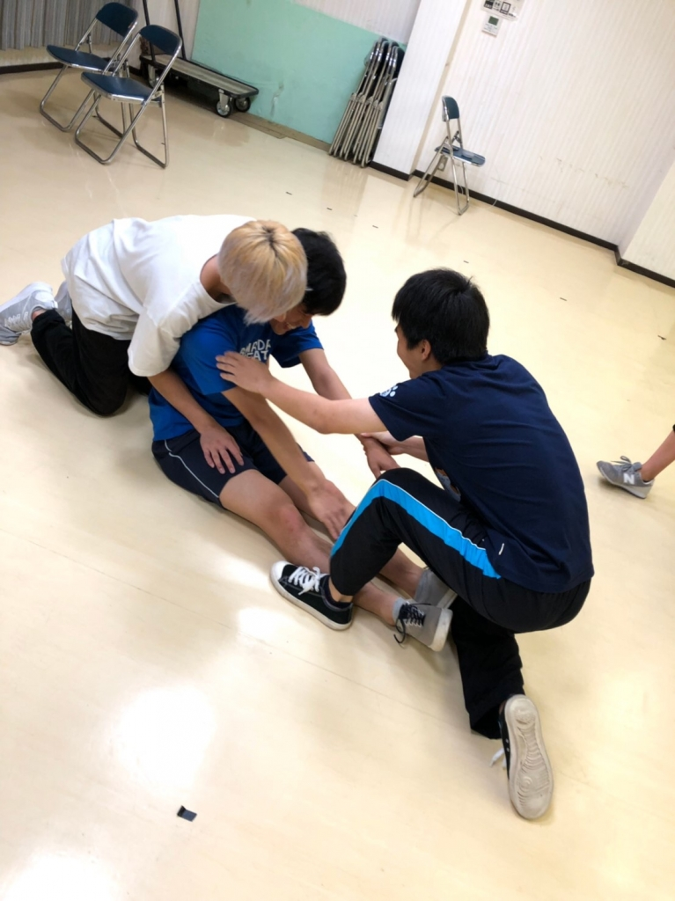

写真は毎年1人は大体いる身体硬い族ですかね？

僕も硬いほうなんで気持ちが痛いほどわかります。

こんばんは、ケイスケホンダに勝ちたい4回生のかなめです。

ブログの書き出しって何書いたらいいのかわからないですね。ブログもそうなんですが、読書感想文とかレポートの書き出しもいつも悩みます。

一度流れに乗ってしまえばすらすら書けるんですが、それまでが難しいですよね。

そんな話はさておき、本日は通しがありました。

振り返ってみると稽古場でシーン回しをしているのをまだ見ていなかったので、すごい新鮮な気持ちで見ることができました。

そんな通しなんですが、みんなすごい楽しそうにしてて安心しました。

やっぱり何事もするなら楽しくするのが一番と僕は思いますね。

一回生も まだこんな時期やのにこんな上手なってんの？！ ってくらいびっくりしました。

通しの後のダメ出しも積極的に演出に聞きにいってて、まだまだ成長するとなるとワクワクしますね。

それでもね、やっぱり自分で通しの映像を見て自分で考えることも大事だと思うのでね、次の言葉で締めたいと思います。

何がダメやったんか、明日まで考えといてください。

そしたら何かが見えてくるはずです。

ほな、終わります。
