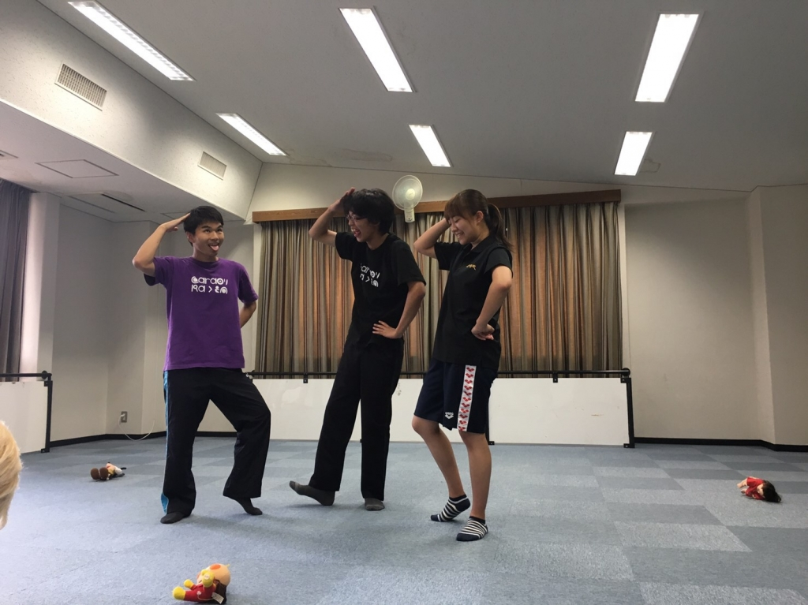

こんにちは、こんばんは

2回生のさつきです

8月に入って早1週間が経ちましたが、

本当に暑いですね、汗が止まりません

部屋の中で座ってるだけで汗をかくので

塩分を取らないとと塩をつまんで舐めてます

皆さんも塩分チャージ忘れずに体調には気をつけてください！

昨日の稽古で初めてのエチュードをしました

その名も「カッコつけエチュード」

名前の通りエチュードないでカッコつけまくるエチュードです

ツラぶったり、舞台意識をしまくる練習で使われるそうですが

発展途上中のエチュードで探り探りではあったものの

みんな「カッコつけ」られていたと思います

ツラにツラにという意識がみんな強すぎてどんツラに横一直線になっていたのは

とても面白かったですね

主張激しい！良いこと！

さて、夏公演本番がどんどん近づいていて

稽古ではマイムであったり言い回しであったり反応であったりの細かい部分の指摘が増えてきました

今から本番まで飛ぶように月日が過ぎると思うので

1日1日課題を持って稽古に臨んで楽しく有意義のある時間にしたいです

タイトルは最近お気に入りのワードです
