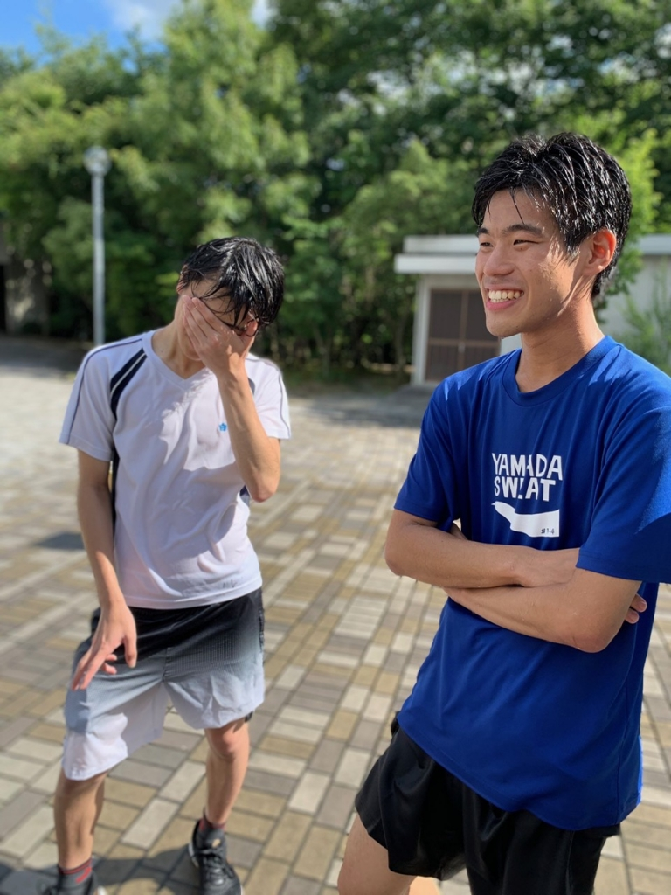

こんにちは 2回目の登場です書記です。

最近ほんとにあついですね。溶けそうです！なんなら脳みそ3分の2くらいは既に溶けてるんじゃないでしょうか！そのくらい暑い！！！外で稽古をする時は気合いのいるシーンを数回回すだけで体力がなくなっちゃいます。弱弱ですね

そんななか 今日は稽古のあいまに水浴びをしました。皆びちゃびちゃでしたね 私はあんまり濡れたくないので必死に逃げました。が、無事キンヨネに浴びせられました 許せないですね。楽しかったからまあ良しとします 写真はびっちゃびちゃのハブちゃんとキンヨネです。

話は変わって、残りの稽古も多分あと10回ほど。早いなぁとしみじみしちゃいます。このチームで練習することもなくなるのな～と寂しくなりつつありますね。みんなでひたすらに演劇と向き合うのが比喩表現抜きでしぬほどたのしいです。残りの稽古も悔いのないように励みたいものですね～！

タイトルはさつき先輩のお気に入りワード？です。

私がよく使ってるらしいんですが そんなにゆるい話し方をしてるつもりはないのにめっちゃアホっぽく真似されます。許せないですね がぶがぶ(これも多用される)

長々とかきましたがこのへんで。だいぶとっ散らかったブログになってしまいました キンヨネみたいなブログは一生かける気がしません。ざんねん。
