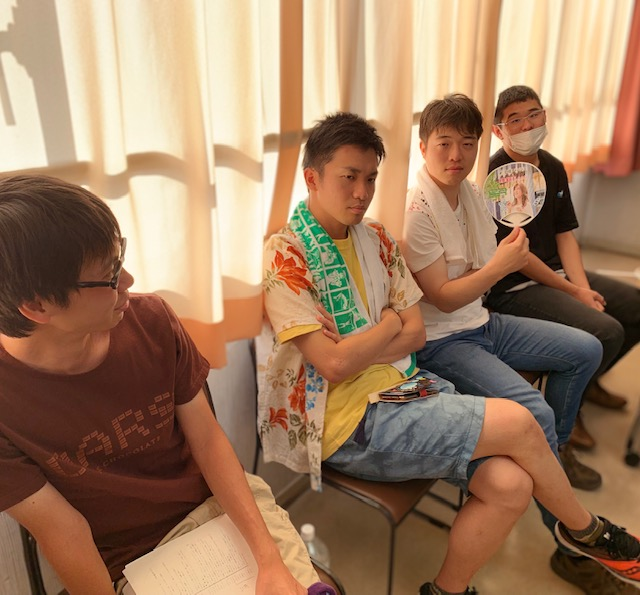
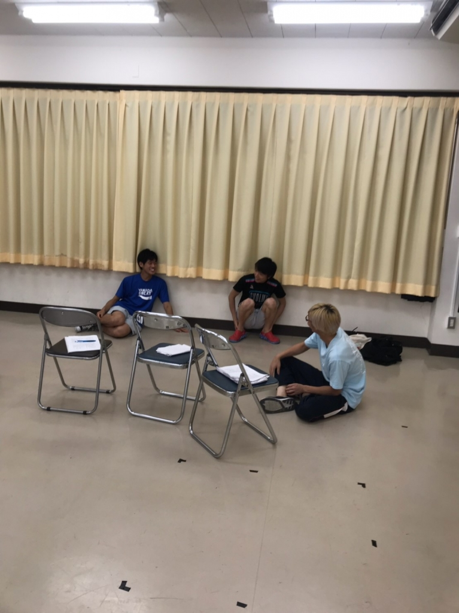

こんばんは。時雨です

つい最近iPhoneXRに買い換えました

先代が画面がバキバキに割れて画面にミカヅキモ飼ってる？みたいな状態になってしまったからです

カメラ撮影のポートレート機能、いいですね

つい写真を撮りたくなってしまいます

画像はそんなポートレート機能で撮影したOBの方々の眼差しです。稽古場の写真がなかったんです……

ブログを書くのも３回目ですね

３回目ともなるとチーム内でも色々なことがありました

最近、ようやく１回生のことがぼんやり分かってきたような気がしてます

みんな良い子ですね

褒め倒して甘やかしたくなる可愛さです

早く皆さんに１回生の姿を見て欲しいですね

なんて言うか、かつてないほど伸び伸びやらせて貰ってる稽古場かもしれません

演出に感謝ですね

年々体調不良が酷くなっている気がします

何科に行けばいいのでしょう

体調不良で休んだ分早めに取り返したいです

アイス食べるのが絶望的に下手な時雨でした

## 写真なくて困ってた人

お疲れ様です、2週目書くことになったムージです。自分が見に来た時の写真がなかったためその時に近い状況の写真を引っ張ってきました。

その日最初は一回生と一緒に基礎練をしました。アメンボ関連とけつかみは苦手な上久しぶりにやったためかなり下手でした。早口言葉の定番にあげられる１つを後輩に説明することができたので嬉しかったです。

その後はパンフ撮影と夏公演に向けてのシーン回しを並行に進めている状況でした。パフォーマンス系は演出が力を入れているのもあり(もちろん全部全力だと思いますが)とてもみんなスイッチが入っているように見えました。 一回生はすぐ演出に改善点や工夫点のアイデアを持ち出したりしていてとても真面目な姿勢を拝見できました。 本番まで2週間ちょっとになりもうすぐキャンプもあるのでよい勢いで突っ走って欲しいです。

iPhoneから送信
