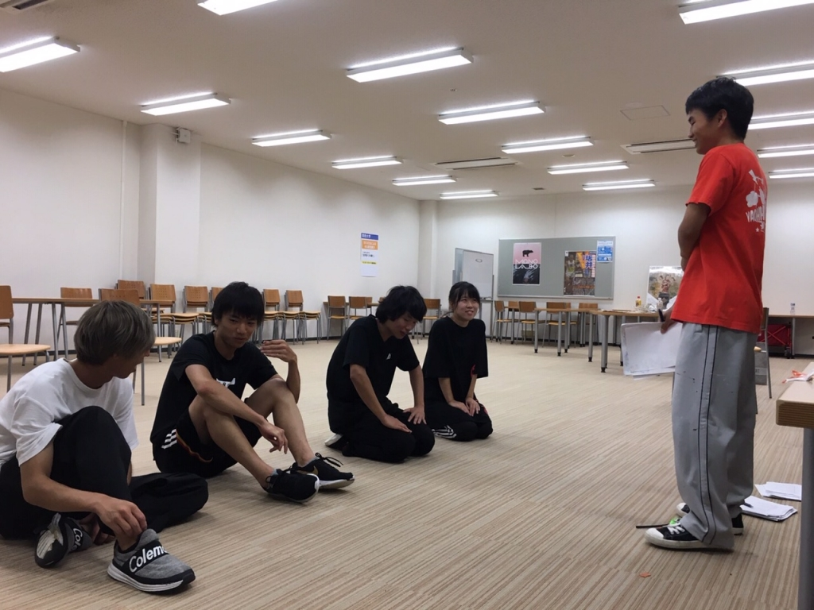
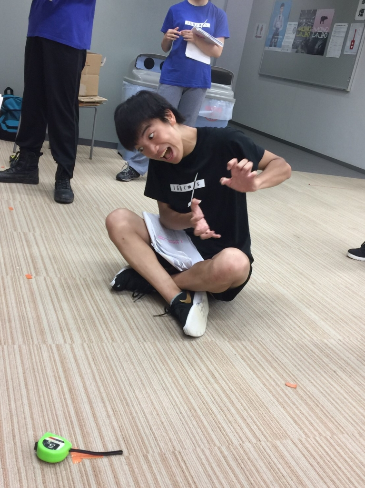

3度目まして 書記です。

本番まで練習があと少しとなりましたが、みなさん調子のほどはどうでしょうか。私はこの期に及んでじわらいに悩まされております。私ってどうしようもなくゲラなんですよね、そしてハブられメタルとかいうゲラ殺人兵器がこのチームに存在しちゃってるわけです。もう駄目です。視界の隅にハブちゃんがいるだけで笑いがこみあげてきます。げげさんにどうやったらゲラが治るか聞いたら横隔膜を摘出して笑えなくするしかないって言われました。私もそれしかないなと思います。

ちなみにじわらいって自笑いって書くんでしょうか。はたまた地笑いって書くんでしょうか…小一時間悩みましたが分かりません 誰かじわらいの治し方と共に教えてください。

劇中にダンスがあるんですけど、それはいくら笑ってもおっけーなのでそれだけ救いですね。こう見えてチアダンスを習っていた経験があるのて踊りながら笑顔を作るのは大得意です。ダンス楽しいな～～マジで…あ、これネタバレ？

…じわらいから逃げてる場合じゃないですね、残りの稽古でばっちり真剣な顔ができるように頑張ります それではこのへんで。写真は最近の稽古場のようす(わさびさんにお叱りを受けるげげさん)です。

## 今回のブログはタイトルから話し始めます。ついに稽古もあと少ししかありませんね。焦りと寂しさが生い茂りますね。

秒速160センチメートルのみなさんには本当に感謝です！これ以上迷惑かけれないんじゃないかというぐらいかけたかもしれないですが、捨てずに親切に接してくださり本当にありがとうございます！

秒速160センチメートルのみなさんは僕の師匠としてこれからもよろしくお願いします！

小栗旬俳優になるための僕の道のりはまだまだ続くぜ

小栗旬俳優になるためのファーストステップとしてまずやるべきなのは、稽古に遅刻しないように努力します！

そろそろ書いている僕も読んでいるあなたもうるうるしてきたと思うのでこのへんで！

ではまた！

iPhoneから送信

## ホームレスの家ってなんだ？

リュックを長く背負ってたら肩が痛くなりますが、これってリュックが合ってないからじゃかいですよね？

4回生のかなめです。

キャンプの時にメガネが壊れたので、買い替えに行ったんですけど、合うメガネがなかなかなくて、5分くらい迷った挙句 これでええやろ～ってな感じで選びました。

じゃあコンタクトでええやんって話ですが、めんどくさいので却下です。

最近思うのが、自分の行動基準として

めんどくささ>面白そう

になるとまあ行動しないんだなって思いました。

でもそれって当たり前な話でしたね。

みんなもそうなんじゃないかなって思います。

「イエスマン “YES”は人生のパスワード」っていう映画を観たんですけど、めんどくさがらずにやってみるのもいいのかなって思わされました。

ちょっと内容をいうと、

ホームレスを家まで送って携帯を充電が切れるまで貸して、手持ちのお金をあげたら綺麗な女の人とキスができた。

どうですか？観たくなりましたよね。

アマゾンプライムビデオにあるので、契約してる人は是非見てください。

写真は可愛い可愛い一回生のハブられメタルです。可愛いですね～。
