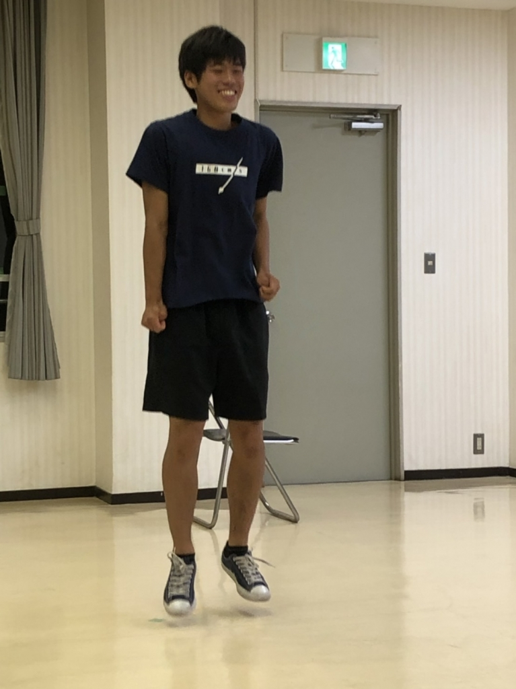

お疲れ様でーす。殿です。

今日は最後から数えて2回目の稽古でしたね！パフォーマンスなんかに力を入れてみんなで集中して取り組みました！

そんな稽古ですが、はじめての事がありました。それは、、わさびさんが稽古場にいなかったんです！！

我らが元気な演出も、留年の恐怖には抗いきれず、敢え無く連れていかれました…

ここらで書く事がなくなってきたので、新企画でも始めようと思います。

そう、タイトルの通りリレーです！

と言うわけでどらこじにパス↓

はい！というわけでバトン受け取りました！どらごん小次郎です！

今日も稽古場に行ったのですが、実は僕の最終稽古は昨日だったんです。というのもサンプラーがないからなんです。僕はSEのオペを担当するんですけどサンプラーがなくて音を流せない…稽古場では小道具を作るだけの人になってしまいました。

あっ、動画も撮ってました。ちゃんと仕事してます！

役者のみんなは明日が最終稽古なので最後までしっかり頑張ってください！

それでは僕はここで失礼します。締めは任せた！さんちゃーーーーーーん！

最後にバトンを受け取りましたのは、陸上でもアンカーをやってたさつきです

こんな形でブログを書いたことがなかったのでたまにはこういうのもおもしろいですね

僕がブログで一番楽しいのはタイトルを決めることなんですよね

いつもはブログの内容からタイトルを決めてるのですが、タイトルはもう決まってるみたいなのでサブタイトルつけます

「秒速30万キロメートル」

上の2人が言ってる通り次で最終稽古なんですよね

え、、マジで次が最後なんですかね？

ん？ドッキリかなんか？

ってなぐらい実感がありません

本当にあっという間の夏でした

本当に楽しい夏でした

決して一回生の時の夏が楽しくなかったわけではないですが

自分のことだけで精一杯だった一回生の時と比べて

まだ少し余裕ができて一回生に教えることで

また違う視点から演劇を考えることが出来て楽しかったです

また、単純にこのチームの一回生の一人一人の個性が強すぎて

それを見るのが楽しかったってのもあります

とにかく楽しみ尽くした夏でした

後は夏公演を成功させるだけです

本当に良かったと、最高の夏だったと言うために

残りを駆け抜けるだけです！

夏公演成功させるぜええええええええええええええええ！！！！！

写真は何だか楽しそうなヨネちゃんです
