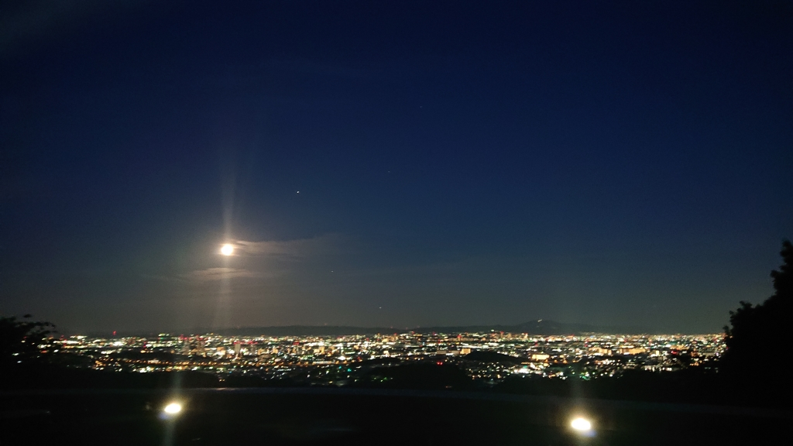

こんにちは、みかどです。

夏公演、始まりました。

そして、早々にブログの順番が回ってきました。

特に書きたいことはありません。

なので、

最近思ったことや感じたことを書きたいと思います。

・1回生について

私が所属する井上スイミングスクールには、5人の1回生がいます。

ルイ君

まゆみ

みとちゃん

花子さん

ナデコ

夏定番の言い方で表現すると、「まさかこの1回生と同じチームになるなんて

思わなかった…」という感じです。

みんな個性豊かで話していてとても楽しいです。

そして、

2年前の一回生だったころの私と重ねてしまいます。

あの頃私が抱いていた気持ちを今の1回生も感じてるのかなーとかとか…

先日書記ちゃんと話して共通点を１つ見つけました。

ツイッターについてです。

1回生は上回生のツイッターを気軽にフォローして良いのかどうか、という

疑念を抱くようです。

私もそうでした笑笑

・夏について

夏はサンダルに限りますよね。

靴なんて暑苦しくて履いていられません。

もうセミがいつ鳴いてもおかしくないような暑さに感じますが、

マジの夏が訪れる前にあいつがやってきます。

そうです、梅雨です。

僕のヒーローアカデミアの梅雨ちゃんは好きですが、

季節の梅雨は嫌いです。

雨をいい意味で捉えると梅雨への嫌悪を和らげることができると

思いますが、今の私には持ち合わせていません。

だれか教えてください。

・ゼミについて

しんどいです。

・アメリカドラマについて

ビッグバン☆セオリーが、

最近の私のトレンドです。

・ドリカムについて

ドリカムの大阪ラバーが、

最近の私のヒットチャート首位独占中です。

今思い出せる最近思うことはこれで以上です。

最後まで読んでくださった方々、ありがとうございました。
