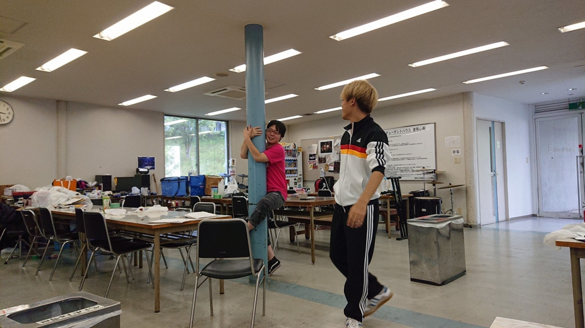

最近、お日様の光が強くて敵いません。

夏公演も役者をやっているヤッキー・Dです。

ブログに書く内容がなくて困ったことはないんですけど、毎回何を書こうか迷います。

考えた結果、「意気込み」でも書いておこうかと思います。

今回の意気込みは…！

楽しむことです！

…あれ。

とても真っ直ぐな気持ちで決めたテーマのはずですが、毎回これを言ってる気がします。

一年生の時から「楽しい」について向き合ってきたつもりですが、未だに解明出来ていません。

しかし、そろそろ方向は見えてきました。

「後悔の無いように」

陳腐な言い回しでしょうか？

でも、この目標を目指すことで前に進めるのではないかと思います。

夏公恒例のチーム分けがあったり、一年生が入ってきて先輩になったり、髪の毛を染めたり、新しい服を買ったり、ポケモンにハマりだしたり…。

全てを楽しんで

「俺が一番楽しんだ」って言えるように努力しちゃいますか～。
