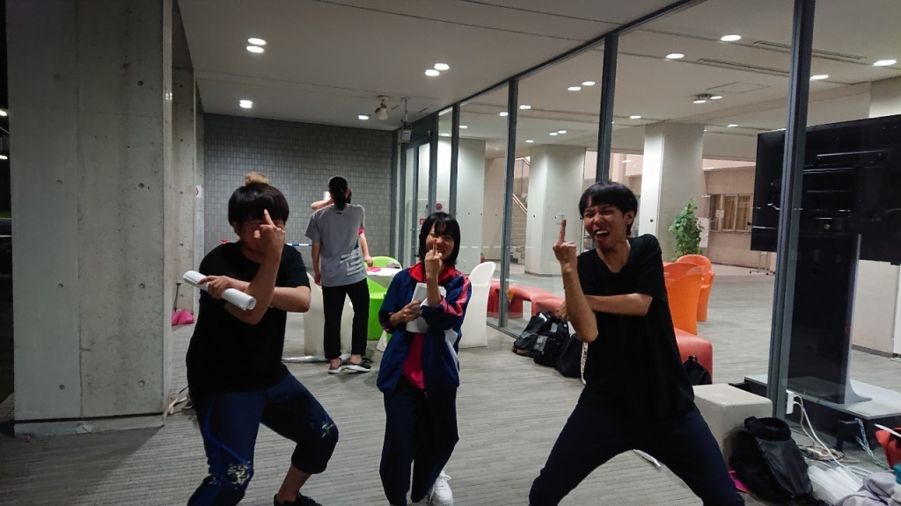

お疲れ様です。堤です！

辛すぎるゼミ活動の反動で稽古が楽しくて仕方ありません！　しかし普段よりハイテンションな分、1回生に引かれていないか心配です。

役作りや段取りの基本的な型が完成しつつあります。これからの咀嚼に期待ですね。どんな個性が見えてくるのか、写真からも分かるように特に1回生は楽しみです笑　

「最近あったこと」

・さ○き宅で2夜連続鍋。

・ゼミ仲間にドーベルマン（犬）に似てると言われる。

・実習にて、万同期に煽られる。
