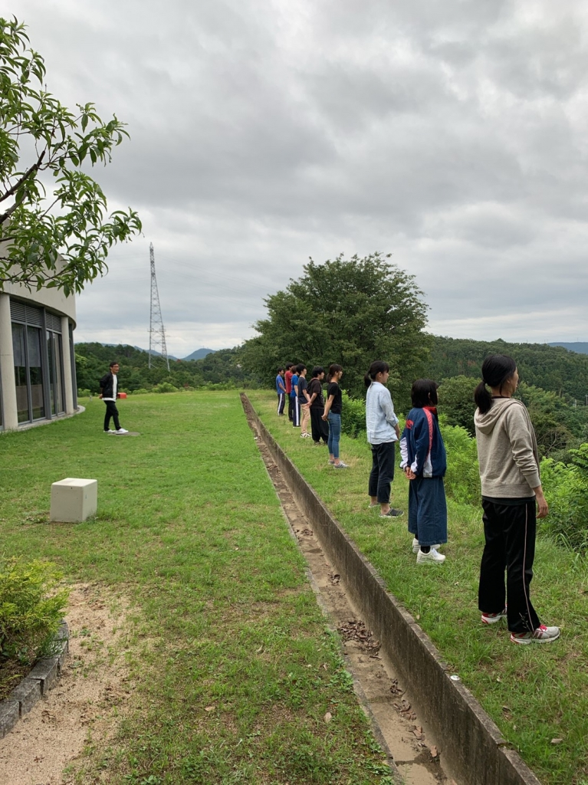
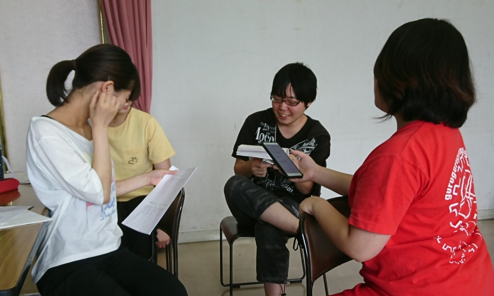

お疲れ様です！2回生のボスメタです！夏場は体調崩しやすくりなりがちな季節ですよね。例えば胃腸とか胃腸とか胃腸とか。もう僕は既に胃腸炎になりました！！！

今回は音響オペです！気づいたらもう4回目なんでよね…なんでや。といっても最近は役者さんの台詞覚えを一緒にやってるんでよすね。この前1回生の子と一緒に台詞覚えをやってたんですが、もう覚えている台詞が多くてびっくり。一緒に覚えた台詞のシーン回しがとても楽しみ！みんな台詞覚え頑張って！！！

この夏では自分自身の音響のスキルアップと役者さんへのダメ出しのクオリティアップを目指していきたいと思います！！！

## わくわく

こんにちは。なつきです。

気づいたら最後の夏公演でした。

といっても最後の夏というのは私にとってで、初めての夏だったり何度目かの夏の人もいます。当たり前ですが。

私はどの夏も楽しくて特別だったので今年もそうなればいいなーみんなもそうだったらいいなーと思います。

今日も稽古場の行き帰りだけで体力ほぼなくなりました。

今でもあついのに8月になるとどうなってしまうんだろう。体力を蓄えるためにもよく食べてよく寝てください。

稽古場ではシーンまわし以外の時間はみんな台本覚えに勤しんでました。この役をあの子がやるとどうなるんだろう～と毎回楽しみにして稽古場に行っています！

まだまだこれからです！とても楽しみです！
