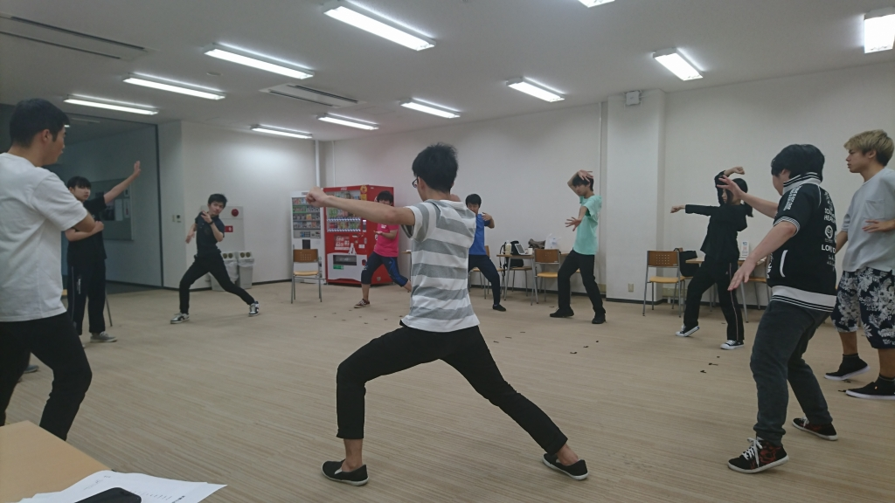

こんばんは、なつきです。

この前ふらっと大阪城公園にいったのですが、たくさん人が遊びに来ていて、遊園地とかにある電車みたいなやつまで走っていてびっくりしました。

大阪城公園もう廃れてると思って完全になめてました。

はとやすずめが住みついているパン屋さんもあったので人が少なそうな時にまたいこうと思います。

そして今日はパンフ撮影でした！

実際にメイクをするとイメージしてたものを目でみることができてとてもわくわくします。

パンフになるのがとてもとても楽しみです！

他にもいろいろ決まっていったり練習でやることが増えていったりと本番が近づいてきていることを稽古場に行くたびに突きつけられ、焦りや寂しさや期待などいろんな感情になります！

また、本日の稽古に、20期生のじょーたろうさんとたきさんが来てくださいました！！！ありがとうございます！！！

夏だと感じることがどんどん増えてきましたが、あつさに負けずに明日も残りのパンフ撮影頑張ります！！
