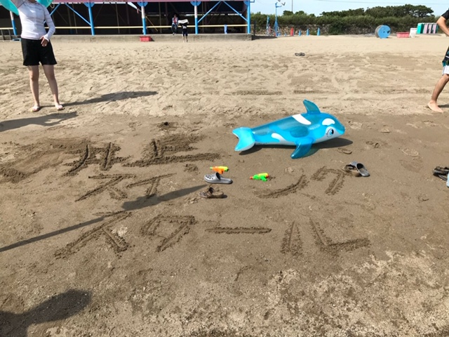

こんにちは、どうも本日はデイビットです。よろしくお願いします。キャンプ明けの稽古になりました！

夏休みの稽古に突入し、気温が高くなっていく中、みんなの士気も気温と同様日々向上していってます。また、今回、振り付けとなるものが存在しますが、そちらも日々上達していっております。

みんな前を突き進み、刻々と迫る夏公演本番に向けて、一段ずつ登っております。

初めて演劇を経験したり、初めての先輩として後輩を迎え優しく教えてあげてたり、またこれが最後の夏になったり、思い出に残る夏になったりなど、それぞれスタートラインや立ち位置は違えど、それぞれの立場からしっかりと夏公演に向けて、一段ずつ登っております。

ぜひぼく達の成長を見届けて下さい！！

p.s.今年もイルカの浮き輪が大活躍しました！！
