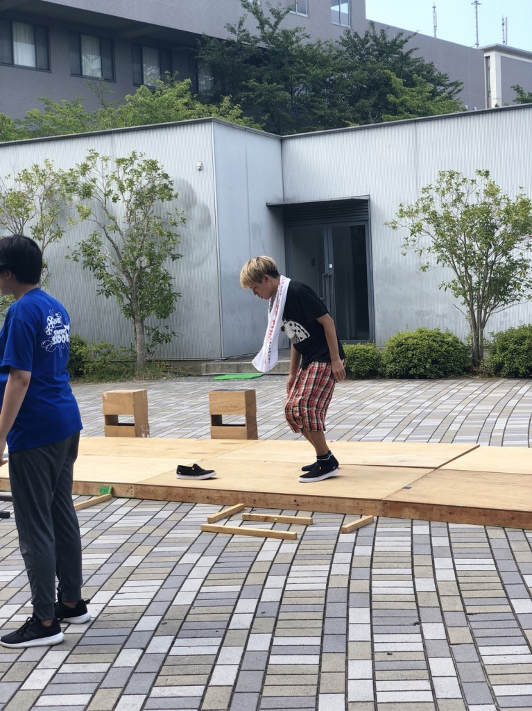
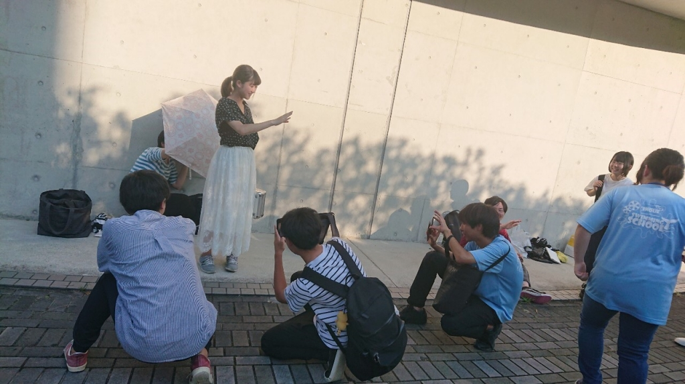

見なくていいって言ってるのに見に来たんですね。

二回生のヤッキー・Dです。

僕はこのブログを投稿するまでに三回書き直しました。

最初は「駄サイクル」をテーマに、二回目は「温故知新」。三回目は「役作り」でした。

じゃあ、結局何を書くのか。

特別なことは書きませんよ。

見なくていいブログってタイトルのブログですよ？

見なくてもいいようなことしか書きませんよ。

見なくていいです。

まだ、見てるんですか？しつこいですね。見なくていいって言ってるのに。

これ以上繰り返しても面白くないので、そろそろ書きます。

ちなみに、上の空白は20行ずつ空けました。こういうところは揃えたがるのが僕です。

このブログは「見なくてもいい」と書いてあるので、まさか見ている人はいないと思いますが、もし見ている人がいるのだとしたら

「どうせなんか書いてるんだろう」と思いバーっとスクロールしてきたことでしょう。

あれ？違いました？

ここで僕の予想が当たらなかったことに優越感を感じた貴方は品性下劣です。反省してください。

嘘です。品性下劣とまでは言いませんが、そんなに性格は良くないかもしれませんね。

嘘です。こんな議論どうでもいいです。

なぜなら、実際はどうだったかわざわざ連絡してくる人なんていないからです。

あれ？もしかして、あなた今「連絡してやろう」と思いました？

これは典型的な天邪鬼ですね～。実は僕もなんですよ。

あれ？違いました？

一緒にしてすみません。

そろそろこのパターンにも飽きてきましたか？

まあ、見なくていいとは言いましたがもう少し見ていったらどうですか。

見るんですね。そうですか。

さっきから改行が適当になってるのに気づいてましたか？

気づいてないですよね。ザマーみろ。

嘘です。これはもしかしたら気づいた人がいるかもしれません。

そんなあなたは物事の流れをよく見極められる天才肌1％です！！

嘘で～～～す。

よくこういう性格診断ありますよねｗ

くだらね～と思いながらやって、誰にも言いません。それが僕です。

そろそろ気づいたんじゃないですか、このブログの形式に。

今の倒置法ですよ、気づきました？

こんな感じで、何かに焦点を当てながら僕について解説するつもりです。

形式を解説した途端、くだらないことのように思えてきてやる気が無くなってきました。

やめてもいいですか？

こんな風に思ってしまう。それが僕です。

一杯食わされました？

やめると思いきや続ける。

今のは結構気に入りました。

↑の最後に「それが僕です。」ってつけようと思いましたがやめました。

また、つけてやろうと思いましたがやめました。

いやｗやりませんよ？

飽きてきたな。

インターネット検索能力について話そうかとも思ったけど、どうでもいいな。

MAD動画について話そうかとも思ったけど、話したくないから話しません。どうしても話して欲しければ、あの手この手で話させてみてください。

じゃあ、宇宙人の話で良いですか？

...そりゃ返事はないですよね。独り言なんですから。

まあいっか。宇宙人の話もしたくないけど。

急に宇宙人とか言い出されて困惑していると思いますが、言いたいことはシンプルです。

「僕からしたらみんなは宇宙人だけど、みんなはどう思う？」って話です。

シンプルと言いつつ、わざわざ分かりにくいように言いました。

ちゃんと説明します。

ある時、物語で描かれる宇宙人像って「人間と価値観が決定的に違う」ことが多くないか？って思ったんですよね。

本当はもっと色んな物語もあるとは思うんですけど、ここでは僕がそう思ったことが重要です。

けど、それって人間と何が違うんだ？と思ったんですよ。

僕はみんなが何を考えているのか分からないし、分かるって言っている人がいたらひょえ～ってなります。

ひょえ～＝言いようもない気持ち悪さ

実際は、心理学とかありますし説明も出来ると思うので「分かる人」はいるかもしれませんね。

いるかもしれませんが！！！

そういうことではなく！！！

「みんなが宇宙人に見える」って感覚しっくりきません？

僕はくるんですよ。

そんな風にみんなのことが見えています。それが僕です。

って感じで結構色々書いたんじゃないですか～？

う～～～～ん、微妙！（この間メモ帳をスクロールした。）

でも、良くないですか？こんぐらいで。

ごはんも腹八分目が良いと言いますし。

まあ、僕はいつも十分目まで食べるんですけどね。

## はじめまして26期生の撫子です

はじめまして26期生の撫子です。

うちのチームの1回生トップバッターは真弓だ

ろうと言う予想は外れまさかまさかの私でしたね。

文才なんてものは微塵もないのでこういう時

にとても困ります。

期待しないで読んでいただけると嬉しいです。

ブログって何書いたらいいかわからないので取り敢えず他チームの1回生(キンヨネを除く)

に倣って自己紹介をしようと思います。

まず芸名の由来ですが、特に趣味等から来た

訳ではなくパッと見の印象から名付けられた

ような気がします。大人しいのは最初だけな

ので高校時代の友人に言ったら似合わないと

爆笑されました。自分でもそう思いますが気に入っています。

宮城県出身で中高バドミントン部でした。

コブクロが好きです。先月初めてライブに行

かせて頂いたんですけど、もう最高でしたね。

特に趣味もないので自己紹介はこの辺してお

こうかと思います。

最近の稽古について話そうかと思います。

先輩方とも徐々に打ち解け毎日の稽古がとて

も楽しいです。OBOGさんがよく来て下さり

お話したい気持ちは山々なのですがコミュ障

を発揮してなかなか話せずにいます。

お盆に入ってからは外稽古が多くて溶けてし

まいそうですがくたばっている訳にはいきま

せん。あと２週間も無いというのにまだまだ

課題が山積みですからね。折角の良いシーン

を台無しにしないように死ぬ気で頑張ろうと

思います。

ヤッキーさんがいつぞやのブログでぶっちゃ

けろと仰っていたのでぶっちゃけますね。

河川敷で稽古をした時のことなんですけど

地面に落ちていたセミを見て、美味しそう。

と呟いた先輩がいました。ドン引きですね。

美味しそうと言ったのはヤッキーさんです。

ぶっちゃけると言いましたが、これで合って

いるんでしょうか…。違う気がしますね…。

写真は「すまんな悠太」と言っていっている

ところです。そろそろがっしーさんに嫌われ

てしまいそうなので控えめに生きようと思い

ます。

それではこの辺で失礼します。
