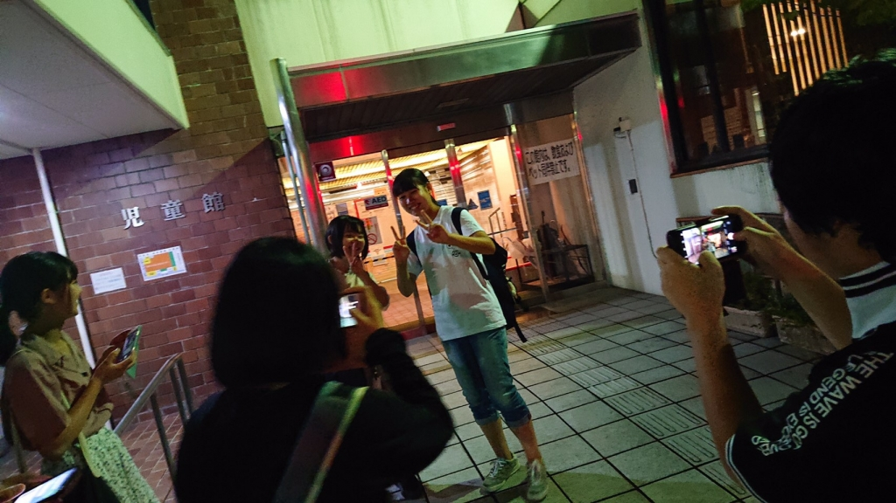
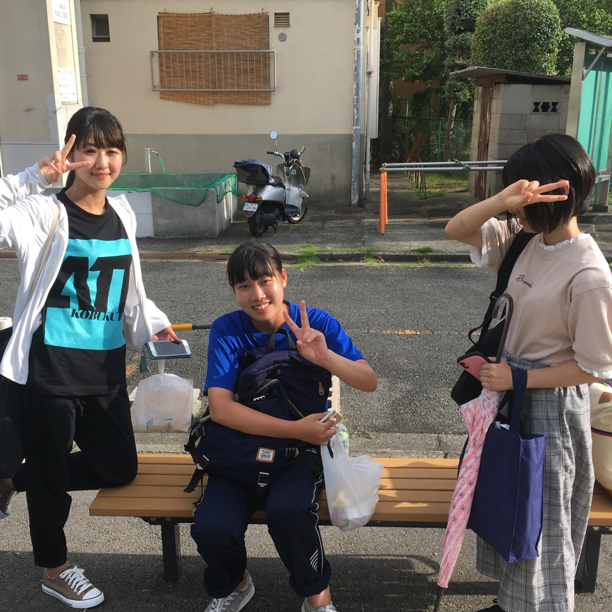

どーも、花子さんです。まぁ、まずは自己紹介

したいと思います。

この芸名ですが、back number が好きだって

話をしたら「高嶺の花子さん歌ってる人たちだ

」って事で決定しました。単純ですね。

今までは結構スポーツをやっていました。ソフ

トボール、テニス、バスケなどなど。演劇とは

無縁の生活を送っていましたね。正直言うと、

別に演劇じゃなくても良かったんです。私がサ

ークルを選ぶときの基準は人と雰囲気でした。

何でも楽しければオールオッケーです。

大学に入ってからの変化は口癖に「なるほど」

が追加されたことです。この言葉、晴がよく言

ってるんですよ。今度注意して聞いてみてくだ

さい笑。「なるほど」ってメッチャ話聞イテル

感アリマスヨネ。

別に話を聞いてないわけではないんですけど、

話聞いてるよって相手に伝えるのに有効な手段

としてよく言います。

暇なときは本を読んだり、映画見たりします。

おすすめがあれば是非教えてください！

以上、自己紹介でした！！

話は変わって昨日の稽古について。昨日は10時

から21時まででした。ホンマにきつい。でも、

そんなことも言ってられません。もう稽古の回

数があまりないからです。ガンバリマス。

もう書くことも思い付かないのでこの辺で失礼

します。

## 高槻のマドンナ、久,保,田,真,弓

おはようございます！

わたくし、生まれも育ちも奈良県奈良市。

性は久,保,田、名は真弓、人呼んで「ク,ボ,タ,マ,ユ,ミ」と発します。

以後、お見知り置かれまして、よろしくお頼み申します。

今回は1周目ということで軽めの自己紹介から始めたいと思います。

僕の芸名である「真弓」は我が関西大学総合情報学部が産んだ屈指の美人教師、久保〇真弓さんが由来になっています。授業を履修してない人や、高槻ミューズキャンパスの人のために例えると、泉ピン子と広瀬すずを足して広瀬すずを１回回収した感じですかね。

まぁ嘘をつきすぎるとバチが当たるのでこの辺で辞めておきます。

今日はたしかドレリハでした。衣装も着て本格的により本番の雰囲気でした。そのおかげか、セリフに詰まったり色々反省点の多いものとなりました。残り1週間で改善して優勝できるように頑張りたいと思います！

そんな時にこれは小耳に挟んだんですけど、近頃何やら、万絵巻の26期生周辺で色恋事が巻き起こりまくってるんだとか。夏公演の練習にかまけて青春しようだなんてけしからんですね。いや、全然羨ましくはないんですけどね。いや、ホントに。全く腹だしいですわ。

恐らく今回が期間的に最初で最後のブログになりそうなので恩師から聞いた少し真面目な話でも挟んでおこうかなと思います。

人間は誰しも、生まれつき「ベール」といものを被っていると言われています。多くの人がそれを大人になるまでに剥がし、一人前の大人になります。なので、小中学生の間に自分で剥がしたり、はたまた他の人の力を借りて剥がすという人もいます。が、この大学生になってもまだそれを剥がせない人もいます。実際にこの大学に入って何人か「ベール」に包まれてるなという人を何人か見かけました。その理由として、単純に勇気が出ないだとか、周りに迷惑をかけてしまうという被害妄想などがあります。「ベール」に包まれたまま大人になった人はほぼ100％後悔しています。しかし、あとひとつの勇気で人間という茎は成長できるんです。それを乗り越えた先には、きっと今まで味わったことのないような新しい世界が待っています。そしてそれは本番にもきっと活かされるでしょう。この「ベール」というものは人によって捉え方が変わってくると思います。それぞれがそれぞれの「ベール」を持っているからです。

まさかここまで真面目に読んでる人はいないと思いますが、ご愛読ありがとうございました！真弓でした！

写真は、久〇田真弓に負けず劣らずの井上スイミングスクールの26期生女子組です！
