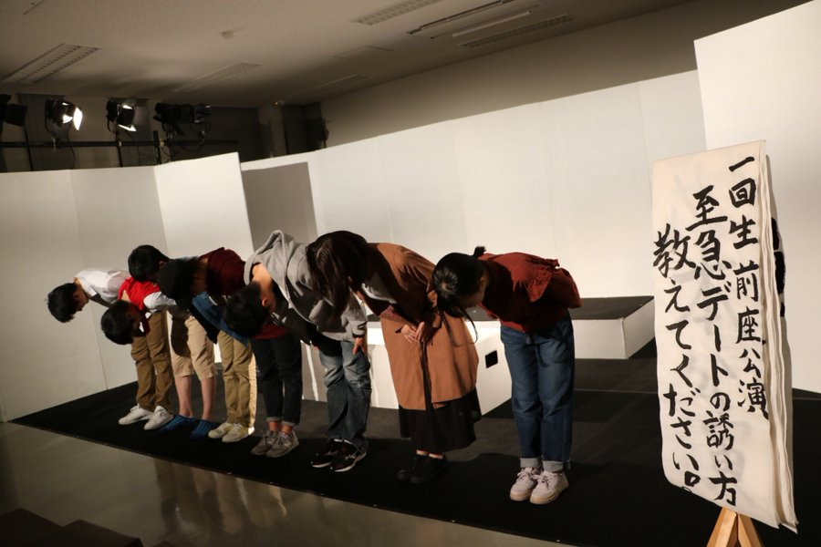
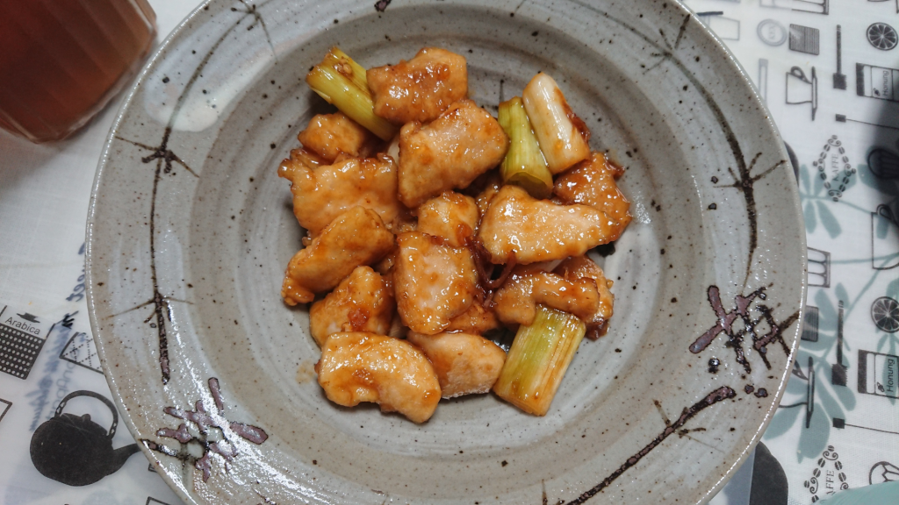

どもっ (＊ﾟ∀ﾟ)っ 自分です。

(この元ネタがわかる人がいたら

教えてくださいね。握手しましょう。)

といっても、誰かわかりませんよね。

自己紹介します。

関西大学総合情報学部1回生

劇団万絵巻26期生「ルイ」と申します。

名前の由来としては元々のあだ名から

令和の「R」を、抜いた感じですね。

このブログを読まれてる方の中には

名前をもうすでに知っておられる方も

いらっしゃるかもしれませんね。

自分は高槻キャンパス祭(TC)公演の

前座の演習をさせていただいた者です。

上回生の方の素晴らしい芝居の前で

短かったですが、

芝居を打たせていただけたのは

すごく嬉しかったです。

冒頭の写真はTCの前座のゲネの時の

写真ですね。まだみんな青いですね。

さて、自己紹介を続けますね。

演劇は中学から始めたので、

今年で7年目を迎えます。

高校では全国も経験してます。

その年は優秀賞だったかな？

おそらく現役の万民の中でも、

長い方ではないでしょうか？

といっても、演技は超のつくほど大根です。

演出や裏方がメインだったので。

稽古やエチュードで、回りに迷惑かけて

ばっかりのダメダメ経験者です。

ですので、この夏の芝居は

自分以外の1回生を

しっかり見てあげてくださいね。

いままでやってきた

芝居のジャンルは会話劇です。

万絵巻はエンタメ劇をよくする劇団なので、

新ジャンルにも挑戦していきたいですね。

さてさて、タイトルにもある通り、

自分は「ルイ」って名前ですが、

男です。男のはずです。

万民の一部から、特に同期の女子から

女子とよく言われます。

理由としては、

・家事全般好き。特に料理。

・買い物好き。特にファンション。

・男子が苦手。(小学校の頃に色々あって)

・恋バナ好き。万でも噂を聞きますね。

・筆箱に色ペンが6本以上入ってる。

‥etc

という感じです。

最初は抵抗感がありましたが、

もう慣れましたね(笑)

まあ、女子といる方が楽しいので、

自分はどっちでもokです。

(決して女好きというわけではないです。)

それと、何日か前のブログでヤッキーさんが

１回生何かぶっちゃけろ的なことを

おっしゃってましたね。

自分も何かぶっちゃけますか。

栗田さんチームの1回生で

トランプをするときに

何か質問に答えるという

罰ゲームをするのですが、

その中であったものをひとつ。

Q.一番信頼している上回生は？

A.ずかちゃん先輩(即答)

現役万民の方だとほとんどが

知ってるでしょうね。

上回生の中で一番お世話になってます。

万民の方は先輩のことを

「ポンコツ」だの、「アホの子」だの、

揶揄されてますが、

自分は全くそう思ってません。

オフの時でも、優しく接してくれますし、

相談事を真摯に聞いてくれます。

自分にとってはすごく便りがいのある

お姉さんです。

今回他チームなのが少し残念ですね。

先輩見てるかな？

9月楽しみにしてますね✨

ぶっちゃけになってない気もしますね(笑)

長々と書いてしまいましたね。

自分は、このようにものを

書くことが大好きですので、

別の機会でブログを書く際も

長文になることをご了承下さい。

最後に、自分は万絵巻で、

演出をしてみたいです。

万絵巻ならではのものと、

自分が中高6年間で培ってきたものとを

重ね合わせた芝居をしたいですね。

いつか皆さんにその様な芝居を

お見せできるようがんばります。

まだまだ書き足りませんが、

また機会があったら色んなことを

書きたいですね。ではまた。

【今日の献立】

むね肉の焼き鳥風

《材料(二人分)》

・鶏肉:200g

(写真はむねですが、ももやササミ等でもok)

・長ネギ:1本

・塩:少々

・片栗粉:適量

・サラダ油:大さじ1杯

(写真ではグレープオイルを使ってます)

◎調味料

・酒:大さじ1杯

・みりん:大さじ2杯

・砂糖:小さじ1杯

・醤油:大さじ1杯

・おろししょうがチューブ:3cm

《調理手順》

1.鳥むね肉を削ぎ切り一口大に切る。塩をふり、

ボールに移し、片栗粉をまぶす。

※両面にしっかりと片栗粉をつける

2.ネギを3cm幅に切る。

3.フライパンに油を入れて熱し、

むね肉、ネギを入れて

両面焼き目がつくようまで中火で焼く。

※ネギは菜箸で少し押し潰せるように

なるまで焼く。

でないと、少し固くなります。

4.3.に◎を加えて、たれを絡める。

鳥むね肉は高たんぱく、低脂肪で、

イミダゾールジペプチドと呼ばれる

抗疲労成分が含まれているので、

日々お仕事や勉学、稽古等を

頑張っている方にオススメの食材です！
