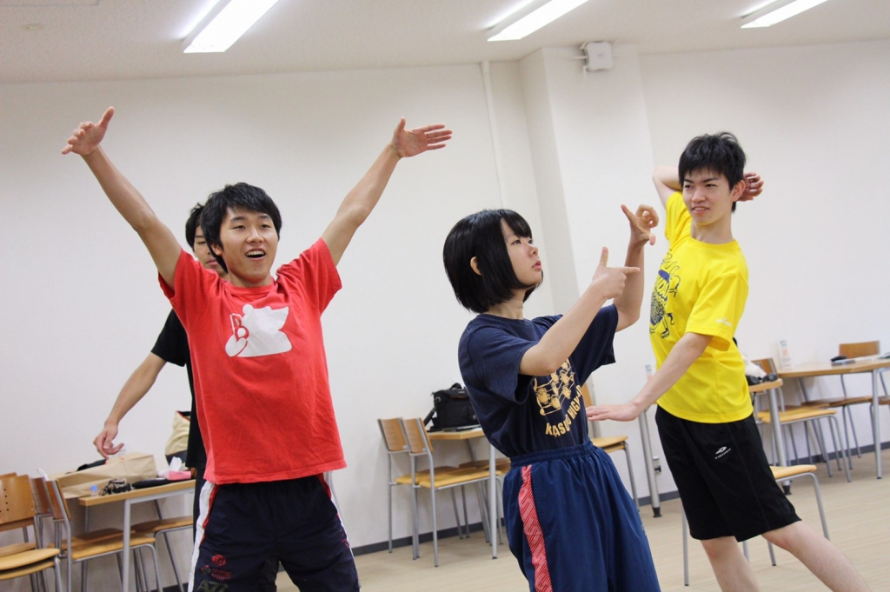

今回初めてブログが回ってきました。

とりあえず他の1回生同様、自己紹介からしたいと

思います。

この芸名の由来は私が納豆が好きだからということで付けられました。水戸納豆からですね。

しかも名付け親はナタリーさんなんです。

今思えばめちゃめちゃ嬉しいですね。

自己紹介で何を書けばいいのかもう分からなく

なったので、万絵巻を選んだ理由を書こうと

思います。

一言で言えばアットホームな雰囲気だったからです。一応MCSやBandits(綴り間違ってたらごめんなさい...)も見に行ったんですけど、万絵巻が1番

楽しそうでした。重ねて大学で1番最初にできた

友達である書記ちゃんも入るということで、

いつもは優柔不断な私も今回は即決でしたね。

そしてこの頃は4年間裏方で生きていこうと決めていた時期でした。それがどういうことか今役者

をやっているのは不思議で仕方ないです。

でも、今年の夏は今までで1番楽しくて充実してます。役者を勧めてくれた先輩方や、背中を押して

くれた同期には感謝しかないです。

話が長くなりそうなので、最後に近況を語って

終わります。

本番まであと1週間もないです。緊張しかしてません。

稽古では、通しや長回しをする機会が増えました。

最初は声が出ていないとずっと言われていたのが

ようやく改善されて、先輩方や同期から褒められた

時リアルに泣きそうでした。...泣いてないですよ。

でも、まだまだ改善点はあるので残りの数日で

できる限り完璧なものに近づけたいと思います。

写真は何時ぞやのポートレートエチュードの写真です。

(ブログ書くの完全に忘れていました。

稽古に行った時に謝っておきます。)
