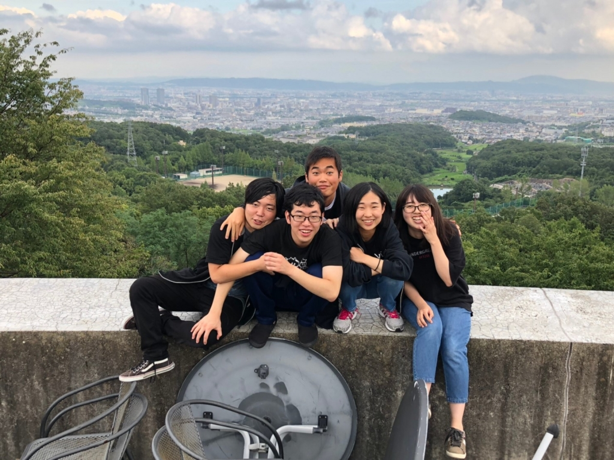

井上スイミングスクールの演出をさせていただいていました、栗田です。

昨日までは無事に公演が終わった安堵感でいっぱいでしたが、

今はみんなとあまり会えなくなるんだなという寂しさでいっぱいです。

僕はほんとうに万絵巻の夏公が大好きです。

1回生の時に感じたキラキラしたものを4回生の夏でみんなに伝えるんだ、

そう思ってずっと万絵巻を続けていました。

伝わったかどうかはわかりません。

ですが、みんなの笑顔や泣いている姿を見て、

出来なかったことも多かったのですが、少しは伝わったのかなと思いました。

そして、こうした思いを誰かがまた、繋いでくれたらなと思います。

一生懸命もがいてもがいて頑張ること、

この公演を通して、僕が学べたことです。

やりきった上で満足や後悔することが大事なんだなと感じました。

忘れられない夏になりました！

ほんとにみんな、ありがとう。

これから、必ずしんどいことや辛いことがあると思います。

でもそれは、君が頑張っているからだと思います！

だから負けずに頑張ってください！

これからのみんなの活躍に期待してます！！
